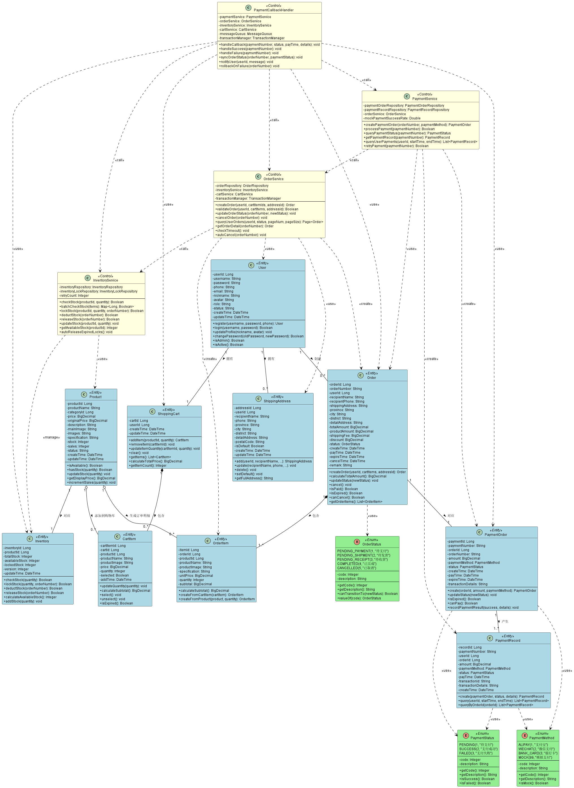

# UC9 & UC10 UML类图设计文档
## 云原生微服务电商平台 - 静态模型建模（第三步）

**项目名称**：云原生微服务电商平台  
**用例编号**：UC9（创建订单）、UC10（订单支付）  
**UML版本**：UML 2.5  
**建模工具**：PlantUML  
**编写日期**：2025-11-04

---

## 一、类图概述

本类图基于UC9（创建订单）和UC10（订单支付）两个用例的详细需求分析，包含17个核心类：
- **实体类（Entity Classes）**：10个
- **枚举类（Enum Classes）**：3个
- **控制类（Control Classes）**：4个

**类关系说明**：本类图严格遵循UML 2.5标准，使用以下4种类关系：
1. **依赖关系（Dependency）**：虚线箭头 `..>`，表示一个类使用另一个类，是临时性的弱关系
2. **关联关系（Association）**：实线 `--`，表示类之间有持久性的结构关系
3. **聚合关系（Aggregation）**：空心菱形 `o--`，表示整体与部分的关系，部分可以独立存在
4. **组合关系（Composition）**：实心菱形 `*--`，表示强生命周期依赖，整体销毁时部分也销毁

---

## 二、UML 2.5 关系符号对照表

| 关系类型 | 中文名称 | UML符号 | PlantUML语法 | 强度 | 说明 |
|---------|---------|---------|--------------|------|------|
| Dependency | 依赖关系 | ······▷ | `..>` | 最弱 | 虚线箭头，临时使用 |
| Association | 关联关系 | ——— | `--` | 较弱 | 实线，持久引用 |
| Aggregation | 聚合关系 | ◇——— | `o--` | 较强 | 空心菱形，整体-部分（部分可独立） |
| Composition | 组合关系 | ◆——— | `*--` | 最强 | 实心菱形，整体-部分（部分不可独立） |

**PlantUML多重性语法**：
- `"1"` 表示1个
- `"0..1"` 表示0个或1个
- `"0..*"` 或 `"*"` 表示0个或多个
- `"1..*"` 表示1个或多个

**示例**：
- `ClassA "1" -- "0..*" ClassB : 关联 >`
- `ClassC "1" o-- "0..*" ClassD : 聚合 >`
- `ClassE "1" *-- "1..*" ClassF : 组合 >`
- `ClassG ..> ClassH : <<use>>`

---

## 三、UML类图

---

## 四、类图关系说明（UML 2.5标准）

### 4.1 关联关系（Association）- 实线

**定义**：表示类之间有持久性的结构关系，通常通过成员变量实现。

| 关系 | 多重性 | UML符号 | 说明 |
|------|--------|---------|------|
| User → Order | 1:N | `--` | 一个用户可以创建多个订单，订单持有用户ID |
| User → ShoppingCart | 1:1 | `--` | 一个用户只有一个购物车，购物车持有用户ID |
| User → ShippingAddress | 1:N | `--` | 一个用户可以有多个收货地址，地址持有用户ID |
| Order → PaymentOrder | 1:1 | `--` | 一个订单对应一个支付订单，支付订单持有订单ID |
| PaymentOrder → PaymentRecord | 1:N | `--` | 一个支付订单可能有多条支付记录（重试场景） |
| Product → Inventory | 1:1 | `--` | 一个商品对应一个库存记录，库存持有商品ID |

**关联特点**：
- 双方都可以独立存在
- 通过外键或引用连接
- 生命周期独立

---

### 4.2 聚合关系（Aggregation）- 空心菱形

**定义**：表示整体与部分的关系，但部分可以独立存在，是一种较弱的"拥有"关系。

| 关系 | 多重性 | UML符号 | 说明 |
|------|--------|---------|------|
| Product → CartItem | 1:N | `o--` | 商品可以被添加到多个购物车项，但商品独立于购物车项存在 |
| Product → OrderItem | 1:N | `o--` | 商品可以生成多个订单明细，但商品独立于订单明细存在 |

**聚合特点**：
- 部分（Product）可以独立于整体（CartItem/OrderItem）存在
- 删除整体不影响部分
- "has-a"关系，但是弱拥有

**举例说明**：
- 购物车项被删除时，商品仍然存在
- 订单明细被删除时，商品仍然存在
- 商品是可以被多个购物车和订单共享的

---

### 4.3 组合关系（Composition）- 实心菱形

**定义**：表示强生命周期依赖，整体销毁时部分也必须销毁，是一种强"拥有"关系。

| 关系 | 多重性 | UML符号 | 说明 |
|------|--------|---------|------|
| Order → OrderItem | 1:N | `*--` | 订单包含多个订单明细，订单删除时明细也删除 |
| ShoppingCart → CartItem | 1:N | `*--` | 购物车包含多个购物车项，购物车清空时项也删除 |

**组合特点**：
- 部分不能独立于整体存在
- 整体销毁时，部分也必须销毁
- "contains-a"关系，强拥有
- 部分只能属于一个整体

**举例说明**：
- 订单被删除时，该订单的所有订单明细也被删除
- 购物车被清空时，该购物车的所有购物车项也被删除
- OrderItem不能脱离Order独立存在

---

### 4.4 依赖关系（Dependency）- 虚线箭头

**定义**：表示一个类使用另一个类，是临时性的弱关系，通常通过方法参数、局部变量或静态方法调用实现。

#### 4.4.1 实体类对枚举的依赖

| 类 | 依赖的枚举 | UML符号 | 说明 |
|----|-----------|---------|------|
| Order | OrderStatus | `..>` | 订单使用订单状态枚举 |
| PaymentOrder | PaymentStatus, PaymentMethod | `..>` | 支付订单使用支付状态和支付方式枚举 |
| PaymentRecord | PaymentStatus, PaymentMethod | `..>` | 支付记录使用支付状态和支付方式枚举 |

#### 4.4.2 控制类对实体类的依赖

| 控制类 | 依赖的实体类 | UML符号 | 说明 |
|--------|-------------|---------|------|
| OrderService | Order, OrderItem, User, ShippingAddress | `..>` | 订单服务创建和管理订单相关实体 |
| InventoryService | Inventory, Product | `..>` | 库存服务管理库存实体 |
| PaymentService | PaymentOrder, PaymentRecord, Order | `..>` | 支付服务创建和管理支付相关实体 |
| PaymentCallbackHandler | PaymentOrder, Order, Inventory, ShoppingCart | `..>` | 支付回调处理器使用多个实体 |

#### 4.4.3 控制类之间的依赖

| 调用方 | 被调用方 | UML符号 | 说明 |
|--------|---------|---------|------|
| OrderService | InventoryService | `..>` | 订单服务调用库存服务校验和锁定库存 |
| PaymentService | OrderService | `..>` | 支付服务调用订单服务查询订单信息 |
| PaymentCallbackHandler | PaymentService, OrderService, InventoryService | `..>` | 支付回调处理器协调多个服务 |

**依赖特点**：
- 最弱的关系
- 临时性使用，不持有引用
- 通过方法参数传递
- 修改被依赖类可能影响依赖类

---

### 4.5 UML四种关系强度对比

| 关系类型 | UML符号 | 强度 | 生命周期 | 举例 |
|---------|---------|------|---------|------|
| **依赖** Dependency | `..>` | 最弱 | 临时使用 | 方法参数、局部变量 |
| **关联** Association | `--` | 较弱 | 独立存在 | User -- Order |
| **聚合** Aggregation | `o--` | 较强 | 部分可独立 | Product o-- CartItem |
| **组合** Composition | `*--` | 最强 | 部分不可独立 | Order *-- OrderItem |

**记忆口诀**：
- **依赖**：用一下就走，来去匆匆（方法参数）
- **关联**：认识你，记住你（成员变量引用）
- **聚合**：你属于我，但你可以走（整体包含部分，部分可独立）
- **组合**：你属于我，生死与共（整体包含部分，部分不可独立）

---

## 五、类图设计要点

### 5.1 分层设计

类图采用分层设计思想，清晰分离关注点：

1. **实体层（Entity Layer）**
   - 包含所有业务实体类（User、Order、Product等）
   - 负责数据建模和业务逻辑封装
   - 实体之间通过关联关系连接

2. **枚举层（Enum Layer）**
   - 包含状态和类型枚举（OrderStatus、PaymentStatus、PaymentMethod）
   - 提供类型安全和可读性

3. **控制层（Control Layer）**
   - 包含服务类（OrderService、PaymentService等）
   - 协调多个实体完成业务流程
   - 实现微服务架构的核心逻辑

### 5.2 关系设计原则

1. **组合关系（Composition）**
   - Order与OrderItem：强生命周期依赖，订单删除时明细也删除
   - ShoppingCart与CartItem：强生命周期依赖

2. **关联关系（Association）**
   - User与Order：弱依赖，订单独立存在
   - Product与Inventory：1对1关系，但独立管理

3. **依赖关系（Dependency）**
   - 控制类依赖实体类和其他服务
   - 采用依赖注入，降低耦合

### 5.3 设计模式应用

1. **服务模式（Service Pattern）**
   - OrderService、PaymentService等控制类采用服务模式
   - 封装业务逻辑，提供统一接口

2. **策略模式（Strategy Pattern）**
   - PaymentMethod枚举支持不同支付方式
   - 可扩展新的支付渠道

3. **观察者模式（Observer Pattern）**
   - PaymentCallbackHandler处理支付回调事件
   - 解耦支付结果处理逻辑

4. **乐观锁模式（Optimistic Locking）**
   - Inventory使用version字段实现乐观锁
   - 解决高并发库存扣减问题

---

## 六、微服务架构映射

根据DDD领域驱动设计和微服务架构，类可以划分为以下服务：

### 6.1 用户服务（User Service）

**负责类**：
- User
- ShippingAddress

**职责**：
- 用户注册登录
- 用户信息管理
- 收货地址管理

### 6.2 商品服务（Product Service）

**负责类**：
- Product
- Inventory
- InventoryService

**职责**：
- 商品信息管理
- 商品展示和搜索
- 库存管理

### 6.3 订单服务（Order Service）

**负责类**：
- Order
- OrderItem
- OrderStatus（枚举）
- OrderService

**职责**：
- 订单创建和管理
- 订单状态流转
- 订单查询

### 6.4 购物车服务（Cart Service）

**负责类**：
- ShoppingCart
- CartItem

**职责**：
- 购物车管理
- 商品加购
- 购物车结算

### 6.5 支付服务（Payment Service）

**负责类**：
- PaymentOrder
- PaymentRecord
- PaymentStatus（枚举）
- PaymentMethod（枚举）
- PaymentService
- PaymentCallbackHandler

**职责**：
- 支付订单创建
- 支付处理和回调
- 支付记录查询

---

## 七、类图统计信息

### 7.1 类统计

| 指标 | 数量 |
|------|------|
| 总类数 | 17 |
| 实体类 | 10 |
| 枚举类 | 3 |
| 控制类 | 4 |
| 总属性数 | 124 |
| 总操作数 | 101 |

### 7.2 关系统计（UML 2.5标准 - 4种关系）

| 关系类型 | UML符号 | 数量 | 关系列表 |
|---------|---------|------|---------|
| **关联关系** Association | `--` | 6 | User-Order, User-ShoppingCart, User-ShippingAddress, Order-PaymentOrder, PaymentOrder-PaymentRecord, Product-Inventory |
| **聚合关系** Aggregation | `o--` | 2 | Product-CartItem, Product-OrderItem |
| **组合关系** Composition | `*--` | 2 | Order-OrderItem, ShoppingCart-CartItem |
| **依赖关系** Dependency | `..>` | 18 | 5个枚举依赖 + 9个控制类对实体依赖 + 4个控制类间依赖 |
| **关系总数** | - | **28** | - |

### 7.3 多重性统计

| 多重性 | 数量 | 举例 |
|--------|------|------|
| 1:1 | 3 | User-ShoppingCart, Order-PaymentOrder, Product-Inventory |
| 1:N | 7 | User-Order, User-ShippingAddress, Order-OrderItem, ShoppingCart-CartItem 等 |
| N:1 | 0 | - |
| N:N | 0 | 本项目未使用多对多关系（通过中间表实现） |
