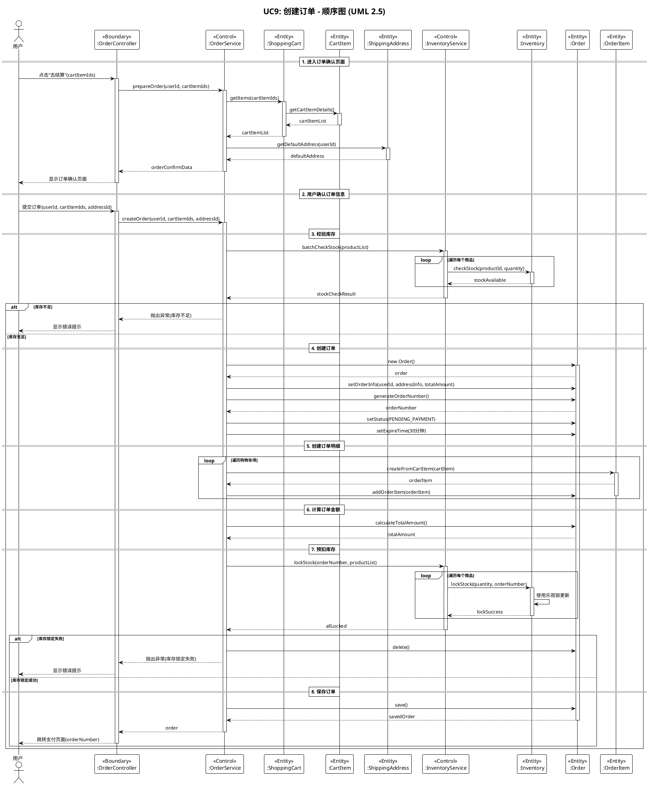
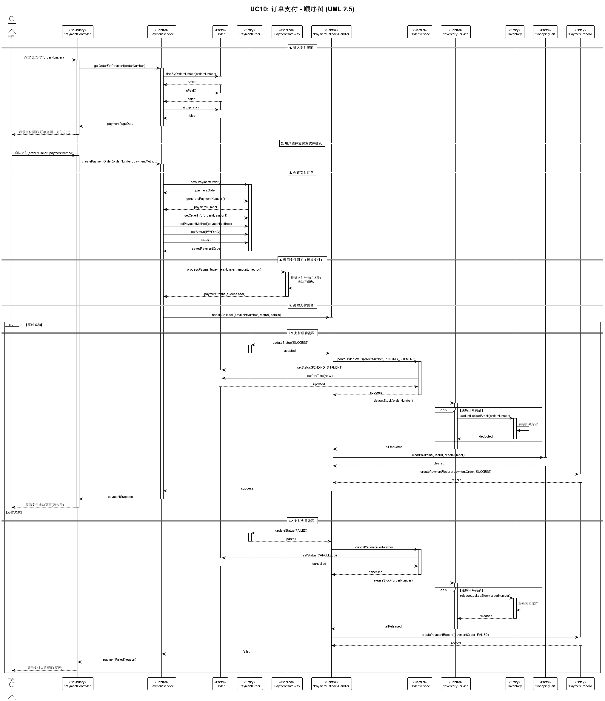
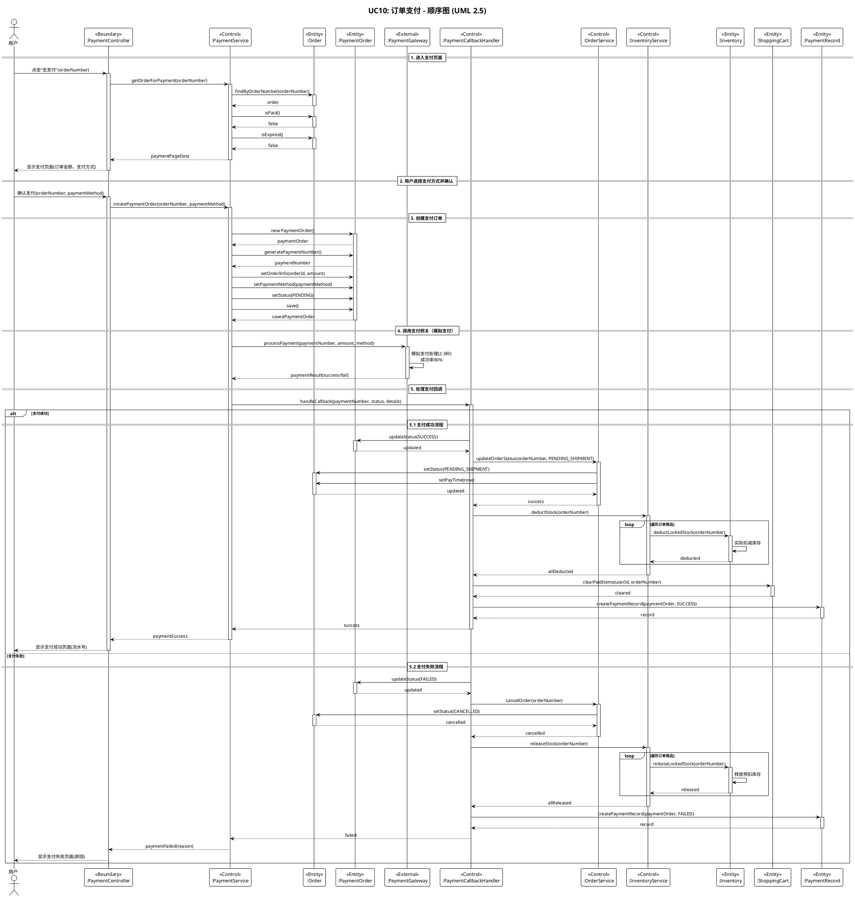
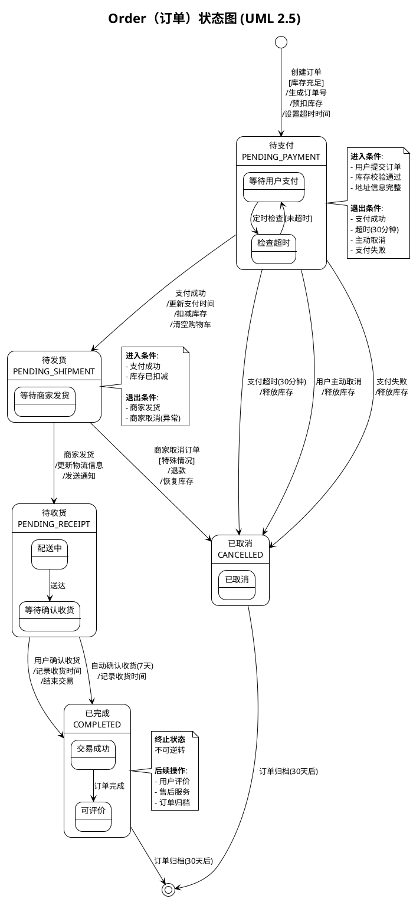
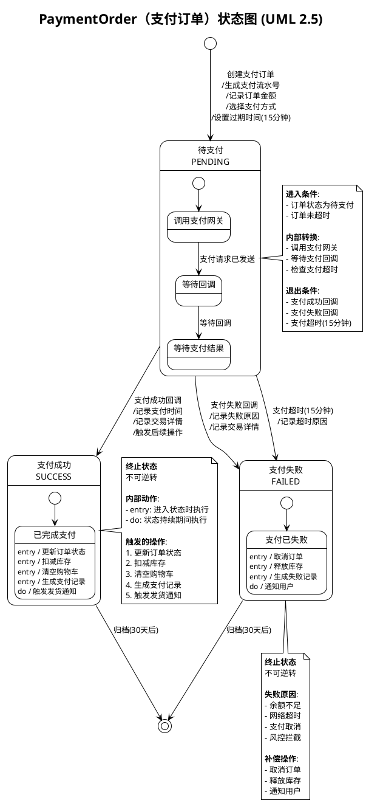

# UC9 & UC10 动态建模文档
## 云原生微服务电商平台 - 动态模型建模

**项目名称**：云原生微服务电商平台  
**用例编号**：UC9（创建订单）、UC10（订单支付）  
**UML版本**：UML 2.5  
**编写日期**：2025-11-04

---

## 一、动态建模概述

### 1.1 什么是动态建模？

**动态模型**是与时间和变化有关的系统性质，描述了软件如何对外部事件或激励做出响应。

动态建模主要包括：
1. **顺序图（Sequence Diagram）**：显示对象之间的交互序列
2. **状态图（State Diagram）**：显示对象的状态及状态转换

### 1.2 动态建模的步骤

根据软件工程方法论，动态建模需要完成以下步骤：

1. ✅ **评估所有的用例**，以保证完全理解系统内的交互顺序
2. ✅ **识别驱动交互顺序的事件**，并理解这些事件如何与特定的对象相互关联
3. ✅ **为每个用例生成序列**
4. ✅ **创建系统状态图**
5. ✅ **评审行为模型**以验证准确性和一致性

### 1.3 UML 2.5 动态建模元素

| UML图类型 | 用途 | 关键元素 |
|----------|------|---------|
| **顺序图** Sequence Diagram | 展示对象间的时序交互 | 生命线、消息、激活框、返回消息 |
| **状态图** State Diagram | 展示对象的状态变化 | 状态、转换、事件、动作 |

---

## 二、顺序图（Sequence Diagram）

### 2.1 UC9：创建订单 - 顺序图

#### 2.1.1 参与对象

| 对象 | 类型 | 说明 |
|------|------|------|
| :User | Actor | 用户（主要参与者） |
| :OrderController | Boundary | 订单控制器（接口层） |
| :OrderService | Control | 订单服务（业务逻辑层） |
| :ShoppingCart | Entity | 购物车 |
| :CartItem | Entity | 购物车项 |
| :ShippingAddress | Entity | 收货地址 |
| :InventoryService | Control | 库存服务 |
| :Inventory | Entity | 库存 |
| :Order | Entity | 订单 |
| :OrderItem | Entity | 订单明细 |

#### 2.1.2 顺序图

> 💡 **PlantUML源文件**: `类图UML/UC9_CreateOrder_Sequence.puml`

---

📝 PlantUML源代码（点击展开）

#### 2.1.3 顺序图说明

**主要交互流程**：

1. **进入订单确认页面**（步骤1）
   - 用户点击"去结算"
   - 系统获取购物车项和默认地址
   - 显示订单确认页面

2. **提交订单**（步骤2）
   - 用户确认订单信息并提交

3. **校验库存**（步骤3）
   - 批量检查所有商品库存
   - 使用循环遍历每个商品

4. **创建订单**（步骤4）
   - 创建订单对象
   - 生成订单号
   - 设置订单状态和超时时间

5. **创建订单明细**（步骤5）
   - 循环创建订单明细
   - 从购物车项转换为订单明细

6. **计算金额**（步骤6）
   - 计算订单总金额

7. **预扣库存**（步骤7）
   - 使用乐观锁锁定库存
   - 循环锁定每个商品的库存

8. **保存订单**（步骤8）
   - 保存订单到数据库
   - 跳转到支付页面

**关键设计点**：
- ✅ 使用 `alt` 片段处理库存不足和锁定失败的异常情况
- ✅ 使用 `loop` 片段处理批量操作
- ✅ 清晰标注对象的生命周期（activate/deactivate）
- ✅ 使用同步消息（实线箭头）表示方法调用
- ✅ 使用返回消息（虚线箭头）表示返回值

---

### 2.2 UC10：订单支付 - 顺序图

#### 2.2.1 参与对象

| 对象 | 类型 | 说明 |
|------|------|------|
| :User | Actor | 用户（主要参与者） |
| :PaymentController | Boundary | 支付控制器（接口层） |
| :PaymentService | Control | 支付服务（业务逻辑层） |
| :Order | Entity | 订单 |
| :PaymentOrder | Entity | 支付订单 |
| :PaymentGateway | External | 支付网关（模拟） |
| :PaymentCallbackHandler | Control | 支付回调处理器 |
| :OrderService | Control | 订单服务 |
| :InventoryService | Control | 库存服务 |
| :Inventory | Entity | 库存 |
| :ShoppingCart | Entity | 购物车 |
| :PaymentRecord | Entity | 支付记录 |

#### 2.2.2 顺序图

> 💡 **PlantUML源文件**: `类图UML/UC10_OrderPayment_Sequence.puml`

---

📝 PlantUML源代码（点击展开）

#### 2.2.3 顺序图说明

**主要交互流程**：

1. **进入支付页面**（步骤1）
   - 用户点击"去支付"
   - 系统查询订单信息
   - 验证订单状态（是否已支付、是否超时）
   - 显示支付页面

2. **创建支付订单**（步骤3）
   - 创建支付订单对象
   - 生成支付流水号
   - 设置支付方式和状态

3. **调用支付网关**（步骤4）
   - 模拟支付处理（2-3秒）
   - 90%成功率

4. **处理支付回调**（步骤5）
   - 使用 `alt` 片段区分成功和失败流程

5. **支付成功流程**（步骤5.1）
   - 更新支付订单状态
   - 更新订单状态为"待发货"
   - 实际扣减库存
   - 清空购物车
   - 生成支付记录
   - 显示支付成功页面

6. **支付失败流程**（步骤5.2）
   - 更新支付订单状态为失败
   - 取消订单
   - 释放预扣库存
   - 生成支付记录
   - 显示支付失败页面

**关键设计点**：
- ✅ 使用 `alt` 片段清晰区分成功和失败两种场景
- ✅ 展示了分布式事务的处理流程
- ✅ 体现了支付回调处理器的协调作用
- ✅ 使用 `loop` 处理批量库存操作
- ✅ 标注了外部系统（PaymentGateway）

---

## 三、状态图（State Diagram）

### 3.1 Order（订单）- 状态图

#### 3.1.1 状态列表

| 状态 | 英文名 | 状态码 | 说明 |
|------|--------|--------|------|
| 待支付 | PENDING_PAYMENT | 1 | 订单已创建，等待支付 |
| 待发货 | PENDING_SHIPMENT | 2 | 已支付，等待发货 |
| 待收货 | PENDING_RECEIPT | 3 | 已发货，等待收货 |
| 已完成 | COMPLETED | 4 | 已收货，交易完成 |
| 已取消 | CANCELLED | 5 | 订单已取消 |

#### 3.1.2 状态图

> 💡 **PlantUML源文件**: `类图UML/Order_StateDiagram.puml`

---

📝 PlantUML源代码（点击展开）

#### 3.1.3 状态转换表

| 当前状态 | 事件 | 守卫条件 | 动作 | 目标状态 |
|---------|------|---------|------|---------|
| [初始] | 创建订单 | [库存充足] | 生成订单号、预扣库存、设置超时 | 待支付 |
| 待支付 | 支付成功 | - | 更新支付时间、扣减库存、清空购物车 | 待发货 |
| 待支付 | 支付超时 | [超过30分钟] | 释放库存 | 已取消 |
| 待支付 | 用户取消 | - | 释放库存 | 已取消 |
| 待支付 | 支付失败 | - | 释放库存 | 已取消 |
| 待发货 | 商家发货 | - | 更新物流信息、发送通知 | 待收货 |
| 待发货 | 商家取消 | [特殊情况] | 退款、恢复库存 | 已取消 |
| 待收货 | 确认收货 | - | 记录收货时间、结束交易 | 已完成 |
| 待收货 | 自动确认 | [7天后] | 记录收货时间 | 已完成 |
| 已完成 | 订单归档 | [30天后] | 归档数据 | [终止] |
| 已取消 | 订单归档 | [30天后] | 归档数据 | [终止] |

---

### 3.2 PaymentOrder（支付订单）- 状态图

#### 3.2.1 状态列表

| 状态 | 英文名 | 状态码 | 说明 |
|------|--------|--------|------|
| 待支付 | PENDING | 1 | 支付订单已创建，等待支付 |
| 支付成功 | SUCCESS | 2 | 支付成功 |
| 支付失败 | FAILED | 3 | 支付失败 |

#### 3.2.2 状态图

> 💡 **PlantUML源文件**: `类图UML/PaymentOrder_StateDiagram.puml`

---

📝 PlantUML源代码（点击展开）

#### 3.2.3 状态转换表

| 当前状态 | 事件 | 守卫条件 | 动作 | 目标状态 |
|---------|------|---------|------|---------|
| [初始] | 创建支付订单 | [订单未超时] | 生成流水号、记录金额、设置过期 | 待支付 |
| 待支付 | 支付成功回调 | - | 记录支付时间、记录交易详情 | 支付成功 |
| 待支付 | 支付失败回调 | - | 记录失败原因、记录交易详情 | 支付失败 |
| 待支付 | 支付超时 | [超过15分钟] | 记录超时原因 | 支付失败 |
| 支付成功 | 归档 | [30天后] | 归档数据 | [终止] |
| 支付失败 | 归档 | [30天后] | 归档数据 | [终止] |

#### 3.2.4 状态内部动作说明

**支付成功（SUCCESS）状态内部动作**：
- `entry /` **进入动作**：状态进入时执行一次
  - 更新订单状态为"待发货"
  - 扣减商品库存
  - 清空购物车
  - 生成支付记录
- `do /` **持续动作**：状态持续期间执行
  - 触发发货通知

**支付失败（FAILED）状态内部动作**：
- `entry /` **进入动作**：
  - 取消订单
  - 释放预扣库存
  - 生成失败记录
- `do /` **持续动作**：
  - 通知用户失败原因

---

## 四、动态建模关系分析

### 4.1 顺序图与状态图的关系

| 视角 | 顺序图 | 状态图 |
|------|--------|--------|
| **关注点** | 对象间的交互序列 | 单个对象的状态变化 |
| **时间维度** | 横向时间轴，展示消息传递顺序 | 纵向时间轴，展示状态转换过程 |
| **适用场景** | 理解用例的执行流程 | 理解对象的生命周期 |
| **UML 2.5元素** | 生命线、消息、激活框 | 状态、转换、事件、动作 |

### 4.2 两种图的互补性

**顺序图**回答：
- ❓ 对象之间如何协作完成用例？
- ❓ 消息的传递顺序是什么？
- ❓ 哪些对象参与了交互？

**状态图**回答：
- ❓ 对象在生命周期中有哪些状态？
- ❓ 状态如何转换？
- ❓ 什么事件触发状态转换？
- ❓ 状态转换时执行什么动作？

### 4.3 顺序图与状态图的映射

| 顺序图中的交互 | 状态图中的体现 |
|--------------|--------------|
| UC9: 用户提交订单 → 创建订单 | Order状态: [初始] → 待支付 |
| UC9: 预扣库存成功 | Order状态: 进入"待支付"，动作：预扣库存 |
| UC10: 支付成功回调 | PaymentOrder状态: 待支付 → 支付成功 |
| UC10: 支付成功回调 | Order状态: 待支付 → 待发货 |
| UC10: 扣减库存 | Order状态: 进入"待发货"，动作：扣减库存 |
| UC10: 支付失败回调 | PaymentOrder状态: 待支付 → 支付失败 |
| UC10: 取消订单、释放库存 | Order状态: 待支付 → 已取消 |

---

## 五、UML 2.5 符号说明

### 5.1 顺序图符号

| 符号 | 名称 | PlantUML语法 | 说明 |
|------|------|--------------|------|
| `→` | 同步消息 | `A -> B: message` | 调用方法并等待返回 |
| `-->` | 返回消息 | `B --> A: result` | 方法返回值 |
| `→)` | 异步消息 | `A ->o B: message` | 不等待返回 |
| `├─` | 激活框 | `activate / deactivate` | 对象被激活的时间 |
| `alt` | 选择片段 | `alt [condition]` | 条件分支 |
| `loop` | 循环片段 | `loop [condition]` | 循环执行 |
| `opt` | 可选片段 | `opt [condition]` | 可选执行 |

### 5.2 状态图符号

| 符号 | 名称 | PlantUML语法 | 说明 |
|------|------|--------------|------|
| `●` | 初始状态 | `[*]` | 状态机的起点 |
| `◉` | 终止状态 | `[*]` | 状态机的终点 |
| `▭` | 状态 | `state "名称" as XXX` | 对象的状态 |
| `→` | 转换 | `S1 --> S2 : event` | 状态转换 |
| `entry /` | 进入动作 | `state : entry / action` | 进入状态时执行 |
| `do /` | 持续动作 | `state : do / action` | 状态持续期间执行 |
| `exit /` | 退出动作 | `state : exit / action` | 退出状态时执行 |
