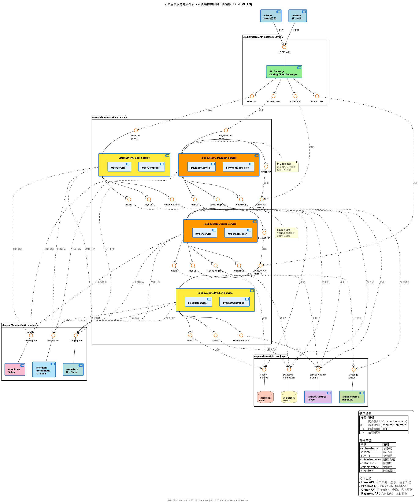
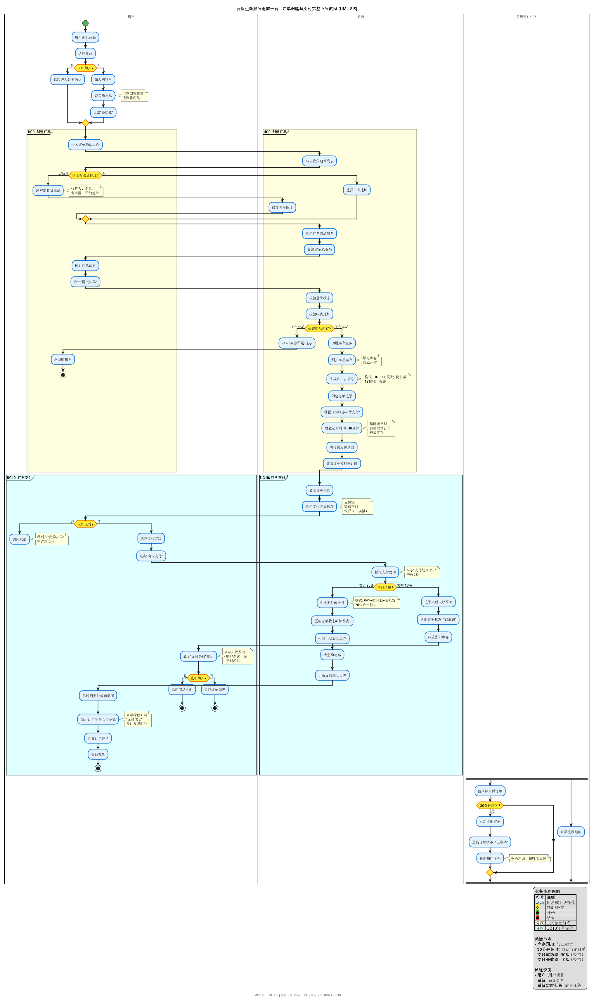

# 软件需求规格说明书(SRS)
## 云原生微服务电商平台

**文档版本**: V1.3  
**编制日期**: 2025-11-05  
**编制团队**: 开发团队(3人)  
**项目负责人**: 开发团队  
**文档状态**: 正式版

---

## 文档修订历史

| 版本 | 日期 | 修订人 | 修订内容 | 审批人 |
|------|------|--------|---------|--------|
| V1.0 | 2025-11-04 | 开发团队 | 初始版本 | 指导老师 |
| V1.1 | 2025-11-05 | 开发团队 | 增加§2.2利益相关者章节，整合利益相关者列表信息 | 指导老师 |
| V1.2 | 2025-11-05 | 开发团队 | 更新§2.2利益相关者内容，与1.利益共同者列表.md保持一致 | 指导老师 |
| V1.3 | 2025-11-05 | 开发团队 | 附录F部署架构转换为UML 2.5部署图（Docker-Compose & Kubernetes） | 指导老师 |

---

## 目录

1. [引言](#1-引言)
2. [总体描述](#2-总体描述)
3. [具体需求](#3-具体需求)
4. [附录](#4-附录)

---

## 1. 引言

### 1.1 目的

本软件需求规格说明书(SRS)详细描述了云原生微服务电商平台的功能性需求和非功能性需求。本文档旨在:

- 为开发团队提供清晰的需求规格,指导系统设计和实现
- 为测试团队提供验收标准和测试依据
- 为项目验收提供评估标准
- 为后续维护和扩展提供参考文档

**预期读者**:
- 开发团队成员(后端、前端、DevOps)
- 指导老师(项目评审)
- 测试人员

### 1.2 项目范围

**项目名称**: 云原生微服务电商平台

**项目目标**:
- 开发一个基于云原生和微服务架构的电商平台原型系统
- 实现商品展示、购物车、订单管理和支付集成等核心功能
- 掌握微服务架构设计和DDD(领域驱动设计)实践
- 学习Docker容器化和Kubernetes编排技术
- 实践CI/CD流水线和系统监控

**系统边界**:

本系统包含:
- 用户服务(注册、登录、个人信息管理、收货地址管理)
- 商品服务(商品分类、商品管理、商品搜索)
- 订单服务(购物车、订单创建、订单管理)
- 支付服务(模拟支付流程)
- API网关、服务注册与发现、配置管理、监控日志

本系统不包含:
- 真实的第三方支付接口对接
<!-- - 物流跟踪功能 -->
<!-- - 客服聊天系统 -->
<!-- - 商家入驻功能 -->
- 积分和会员系统
<!-- - 推荐算法和个性化功能 -->

### 1.3 定义、缩略语和术语

| 术语/缩略语 | 说明 |
|------------|------|
| SRS | Software Requirements Specification, 软件需求规格说明书 |
| DDD | Domain-Driven Design, 领域驱动设计 |
| API | Application Programming Interface, 应用程序接口 |
| REST | Representational State Transfer, 表述性状态传递 |
| JWT | JSON Web Token, 一种身份认证机制 |
| CI/CD | Continuous Integration/Continuous Deployment, 持续集成/持续部署 |
| Docker | 容器化平台 |
| Kubernetes (K8s) | 容器编排平台 |
| Nacos | 阿里巴巴开源的服务注册与配置中心 |
| Seata | 阿里巴巴开源的分布式事务解决方案 |
| Spring Cloud | 微服务框架 |
| MySQL | 关系型数据库 |
| Redis | 内存数据库,用于缓存 |
| RabbitMQ | 消息队列中间件 |
| ELK | Elasticsearch + Logstash + Kibana, 日志分析平台 |
| Prometheus | 监控指标收集系统 |
| Grafana | 监控可视化平台 |
| UC | Use Case, 用例 |
| NFR | Non-Functional Requirement, 非功能需求 |

### 1.4 参考资料

1. 微软eShop参考架构: https://github.com/dotnet-architecture/eShopOnContainers
2. Spring Cloud官方文档: https://spring.io/projects/spring-cloud
3. 《领域驱动设计》, Eric Evans
4. IEEE 830-1998: IEEE Recommended Practice for Software Requirements Specifications
5. 课程教学PPT和实验指导书

### 1.5 文档概述

本文档分为以下几个部分:
- **第1章 引言**: 介绍文档目的、范围、术语定义等
- **第2章 总体描述**: 描述系统的产品视角、功能概述、用户特征、约束条件等
- **第3章 具体需求**: 详细列出功能需求、非功能需求、外部接口需求、用例规约等
- **第4章 附录**: 包含数据模型、业务流程图、技术栈等补充信息

---

## 2. 总体描述

### 2.1 产品描述

云原生微服务电商平台是一个面向学习的电商系统原型,参考微软eShop架构,使用云原生技术栈实现。系统采用微服务架构,将电商业务拆分为用户服务、商品服务、订单服务、支付服务等独立的微服务,每个服务可以独立开发、测试、部署和扩展。

**系统架构概览**:

> 💡 **PlantUML源文件**: `类图UML/系统架构构件图_ComponentDiagram.puml`  
> 💡 **详细说明**: 参见 `2.需求调研文档.md` §5.1

**系统上下文**:
- **用户**: 通过浏览器或移动端APP访问系统
- **管理员**: 通过管理后台管理商品、订单、用户
- **DevOps工程师**: 负责系统部署、监控、运维
- **外部系统**: 第三方支付平台(模拟)、短信服务(可选)

### 2.2 利益相关者

本系统的利益相关者包括3人开发团队和系统用户。作为学生课程项目，团队规模精简，适配大作业要求。

> **参考文档**：详细的利益相关者分析见 [1.利益共同者列表.md](1.利益共同者列表.md)

**利益相关者汇总表**：

| **类别** | **角色** | **人数** | **主要职责** | **关注重点** |
|---------|---------|---------|-------------|-------------|
| **开发团队** | 后端开发工程师 | 1人 | • 设计和实现微服务架构（用户、商品、订单服务） • 实现DDD架构和服务拆分 • 实现分布式事务处理 • 实现服务注册发现、配置管理、API网关 | 微服务架构质量 系统稳定性 代码可维护性 |
| **开发团队** | 前端开发工程师 | 1人 | • 实现商品展示页面 • 实现购物车功能 • 实现订单流程界面 • 实现支付集成界面 • 前后端API对接 | 用户体验 界面美观性 功能完整性 |
| **开发团队** | DevOps工程师 | 1人 | • Docker容器化所有服务 • 编写Docker-Compose部署文件 • 搭建CI/CD流水线 • 实现系统监控和日志追踪 • 编写自动化测试和性能测试 | 部署自动化 系统可观测性 环境稳定性 |
| **系统用户** | 普通消费者 | - | • 浏览商品 • 添加购物车 • 创建订单 • 完成支付流程 | 购物流程流畅性 功能可用性 |
| **系统用户** | 平台管理员 | - | • 管理商品信息 • 查看订单列表 • 处理订单状态 | 管理功能完整性 数据准确性 |

---

**详细说明**：

**SH-1. 后端开发工程师**
- **数量**: 1人
- **主要职责**:
  - 设计和实现微服务架构（用户、商品、订单服务）
  - 实现DDD架构和服务拆分
  - 实现分布式事务处理（Seata或最终一致性方案）
  - 实现服务注册发现（Nacos/Eureka）、配置管理、API网关
  - 设计数据库模型（MySQL）和缓存策略（Redis）
- **关注重点**: 微服务架构质量、系统稳定性、代码可维护性
- **对项目的期望**: 掌握微服务架构、DDD设计、分布式事务等技术

**SH-2. 前端开发工程师**  
- **数量**: 1人
- **主要职责**:
  - 实现商品展示页面
  - 实现购物车功能
  - 实现订单流程界面
  - 实现支付集成界面
  - 前后端API对接（使用React/Vue）
- **关注重点**: 用户体验、界面美观性、功能完整性
- **对项目的期望**: 掌握现代前端框架、前后端分离开发模式

**SH-3. DevOps工程师**
- **数量**: 1人
- **主要职责**:
  - Docker容器化所有服务
  - 编写Docker-Compose部署文件
  - 搭建CI/CD流水线
  - 实现系统监控和日志追踪
  - 编写自动化测试和性能测试
- **关注重点**: 部署自动化、系统可观测性、环境稳定性
- **对项目的期望**: 掌握容器化技术、自动化部署、系统监控等DevOps实践

**SH-4. 普通消费者**
- **数量**: 若干（模拟测试用户）
- **主要职责**:
  - 浏览商品
  - 添加购物车
  - 创建订单
  - 完成支付流程
- **关注重点**: 购物流程流畅性、功能可用性
- **对系统的期望**: 操作简便、响应迅速、功能完整

**SH-5. 平台管理员**
- **数量**: 若干（模拟管理用户）
- **主要职责**:
  - 管理商品信息
  - 查看订单列表
  - 处理订单状态
- **关注重点**: 管理功能完整性、数据准确性
- **对系统的期望**: 管理功能齐全、操作高效、权限控制合理

---

**利益相关者优先级**：

1. **高优先级**: 开发团队（后端、前端、DevOps）- 项目实施和交付
2. **中优先级**: 普通消费者、平台管理员 - 核心功能验证
3. **低优先级**: 外部系统（模拟集成）

**特别说明**：
- 本项目为3人学生团队完成的大作业
- 团队成员精简但分工明确：后端开发工程师1人、前端开发工程师1人、DevOps工程师1人
- 利益相关者设置符合课程要求和团队实际情况
- 系统用户（普通消费者、平台管理员）作为模拟用户进行功能测试

> **注**: 完整的利益相关者分析详见 [1.利益共同者列表.md](1.利益共同者列表.md) 文档。

### 2.3 产品功能概述

系统提供以下核心功能模块:

**F1. 用户管理**
- 用户注册、登录、登出
- 个人信息管理(昵称、头像、密码修改)
- 收货地址管理(增删改查、设置默认地址)
- 角色权限控制(普通用户、管理员)

**F2. 商品管理**
- 商品分类管理(多级分类)
- 商品信息管理(增删改查)
- 商品搜索(关键词搜索、分类筛选)
- 商品详情展示
- 库存管理(查看、更新、扣减、回滚)

**F3. 购物车**
- 添加商品到购物车
- 修改商品数量
- 删除购物车商品
- 查看购物车总价

**F4. 订单管理**
- 创建订单(从购物车生成订单)
- 订单查询(列表、详情、状态筛选)
- 订单取消(用户取消待支付订单)
- 订单状态管理(待支付→待发货→待收货→已完成)
- 管理员订单管理(查看、发货、取消、退款)

**F5. 支付功能**
- 创建支付订单
- 模拟支付操作(90%成功率、10%失败率)
- 支付状态同步
- 支付记录查询

**F6. 系统基础设施**
- API网关(路由、鉴权、限流)
- 服务注册与发现(Nacos)
- 配置管理(集中配置、动态刷新)
- 系统监控(Prometheus + Grafana)
- 日志追踪(ELK Stack + Sleuth + Zipkin)

---

### 2.3.1 用例与功能需求映射表

本系统共定义23个用例（UC1-UC23），涵盖3类角色（普通用户、管理员、DevOps工程师），对应27个功能需求（R1-R27）。

> **🎯 重要说明**：本项目选择 **UC9（创建订单）** 和 **UC10（订单支付）** 作为核心用例进行详细分析和建模。

**完整映射关系表**：

| 用例编号 | 用例名称 | 对应功能需求 | 角色 | 备注 |
|---------|---------|-------------|------|------|
| UC1 | 用户注册 | R1 | 普通用户 | - |
| UC2 | 用户登录 | R2 | 普通用户 | - |
| UC3 | 管理个人信息 | R3 | 普通用户 | - |
| UC4 | 管理收货地址 | R4 | 普通用户 | - |
| UC5 | 浏览/搜索商品 | R8, R9 | 普通用户 | - |
| UC6 | 查看商品详情 | R10 | 普通用户 | - |
| UC7 | 添加商品到购物车 | R12 | 普通用户 | - |
| UC8 | 管理购物车 | R13 | 普通用户 | - |
| **⭐ UC9** | **⭐ 创建订单** | **R14** | **普通用户** | **🎯 核心用例** |
| **⭐ UC10** | **⭐ 订单支付** | **R15, R20, R21** | **普通用户** | **🎯 核心用例** |
| UC11 | 查询订单 | R16 | 普通用户 | - |
| UC12 | 取消订单 | R17 | 普通用户 | - |
| UC13 | 管理员登录 | R2, R5 | 管理员 | - |
| UC14 | 管理商品分类 | R6 | 管理员 | - |
| UC15 | 管理商品信息 | R7 | 管理员 | - |
| UC16 | 管理商品库存 | R11 | 管理员 | - |
| UC17 | 管理订单 | R18, R19 | 管理员 | - |
| UC18 | 查看支付记录 | R22, R23 | 管理员 | - |
| UC19 | 容器化与部署 | - | DevOps | - |
| UC20 | 配置API网关 | R24 | DevOps | - |
| UC21 | 配置服务注册与发现 | R25 | DevOps | - |
| UC22 | 配置管理 | R26 | DevOps | - |
| UC23 | 系统监控与日志 | R27 | DevOps | - |

**核心用例说明**：

**UC9: 创建订单** 和 **UC10: 订单支付** 是本项目选定的核心用例，具有以下特点：

1. **高业务价值**：这两个用例构成了电商平台的核心交易流程，直接关系到系统的商业价值
2. **高技术复杂度**：涉及分布式事务、库存管理、状态流转等复杂业务逻辑
3. **高风险性**：需要保证数据一致性、防止超卖、处理支付失败等异常情况
4. **跨服务协作**：需要用户服务、商品服务、订单服务、支付服务协同工作

**详细分析文档**：
- 详细需求分析：[5.UC9&UC10详细需求分析文档.md](5.UC9&UC10详细需求分析文档.md)
- 场景建模：[6.1场景建模文档.md](6.1场景建模文档.md)
- 静态建模（类图）：[6.2类图设计.md](6.2类图设计.md)
- 静态建模（CRC卡）：[6.3UC9&UC10_CRC卡设计文档.md](6.3UC9&UC10_CRC卡设计文档.md)
- 动态建模：[6.4UC9&UC10动态建模设计文档.md](6.4UC9&UC10动态建模设计文档.md)

**统计信息**：
- 总用例数：23个
- 普通用户用例：12个（UC1-UC12）
- 管理员用例：6个（UC13-UC18）
- DevOps用例：5个（UC19-UC23）
- 核心分析用例：2个（UC9、UC10）

> **参考文档**：完整的用例图和用例关系详见 [3.产品要求文档.md](3.产品要求文档.md) §3

---

### 2.4 用户特征

| 用户类型 | 用户数量 | 技术能力 | 主要目标 | 使用频率 |
|---------|---------|---------|---------|---------|
| 普通用户(买家) | 预计100-500人 | 基本互联网使用能力 | 浏览商品、购物下单 | 中-高频 |
| 管理员 | 1-3人 | 具备基本系统管理能力 | 管理商品、处理订单 | 高频 |
| DevOps工程师 | 3人(开发团队) | 熟悉云原生技术栈 | 部署、监控、运维 | 中频 |
| 指导老师(评审) | 1人 | 了解软件工程和微服务 | 评估系统架构和功能 | 低频 |

> **注**: 用户特征与上述利益相关者分析相对应，详细职责和期望见§2.2。

### 2.5 约束条件

**C1. 技术约束**
- 必须使用Java/Go语言开发
- 必须使用Spring Cloud微服务框架
- 必须实现至少3个独立的微服务
- 必须使用Docker容器化部署
- 必须使用Docker-Compose或Kubernetes编排

**C2. 时间约束**
- 项目开发周期为6-8周
- 必须在学期末完成项目交付和演示

**C3. 资源约束**
- 开发团队只有3人
- 测试环境资源有限(单机或小规模集群)
- 不需要真实的支付接口,使用模拟支付

**C4. 法律和合规约束**
- 用户密码必须加密存储(BCrypt)
- 必须防止SQL注入和XSS攻击
- 用户数据必须安全保护

**C5. 接口约束**
- 前后端必须分离,使用RESTful API通信
- 服务间通信使用HTTP/REST或消息队列
- API必须提供Swagger文档

**C6. 运行环境约束**
- 支持Windows/Linux/MacOS部署
- 浏览器兼容Chrome/Firefox/Safari最新版本
- 数据库使用MySQL 8.0+
- 缓存使用Redis 7.0+

### 2.6 假设和依赖

**假设**:
- AS-1: 用户使用的设备能够正常访问互联网
- AS-2: 用户的浏览器支持HTML5和JavaScript
- AS-3: 测试环境的服务器资源能够满足系统运行需求
- AS-4: 数据库和缓存服务稳定可用
- AS-5: 项目演示时网络环境稳定

**依赖**:
- DP-1: 依赖Spring Cloud框架提供的微服务组件
- DP-2: 依赖Nacos提供服务注册和配置管理
- DP-3: 依赖MySQL提供数据持久化
- DP-4: 依赖Redis提供缓存服务
- DP-5: 依赖RabbitMQ提供消息队列服务
- DP-6: 依赖Docker提供容器化支持
- DP-7: 依赖第三方前端UI框架(Vue/React + Element/Ant Design)

---

## 3. 具体需求

### 3.1 功能需求

#### 3.1.1 用户服务功能需求

**R1 用户注册**

- **需求ID**: R1
- **优先级**: 高
- **用户故事**: 作为一个新用户,我想要通过手机号/邮箱注册账号,以便能够使用平台的购物功能。
- **功能描述**:
  - 用户可以通过手机号或邮箱注册
  - 密码长度6-20位,必须包含字母和数字
  - 用户名长度4-20位,必须唯一
  - 密码使用BCrypt加密存储
  - 注册成功后自动登录
- **输入**: 用户名、密码、确认密码、手机号/邮箱
- **处理**: 校验输入合法性、检查用户名是否重复、加密密码、保存用户信息
- **输出**: 注册成功提示、跳转到首页
- **异常处理**: 
  - 用户名已存在 → 提示"用户名已被注册"
  - 手机号/邮箱已注册 → 提示"该手机号/邮箱已注册"
  - 密码不符合规则 → 提示密码格式要求

**R2 用户登录**

- **需求ID**: R2
- **优先级**: 高
- **用户故事**: 作为一个已注册用户,我想要使用账号密码登录系统,以便访问我的个人信息和订单。
- **功能描述**:
  - 支持用户名/手机号/邮箱登录
  - 登录成功后生成JWT Token(有效期24小时)
  - Token包含用户ID、用户名、角色信息
  - 支持"记住我"功能(Token有效期延长至7天)
- **输入**: 账号(用户名/手机号/邮箱)、密码、是否记住我
- **处理**: 校验账号密码、生成JWT Token、更新最后登录时间
- **输出**: 登录成功、返回Token和用户基本信息
- **异常处理**:
  - 账号不存在 → 提示"账号或密码错误"
  - 密码错误 → 提示"账号或密码错误"
  - 账号被冻结 → 提示"账号已被冻结,请联系管理员"

**R3 用户信息管理**

- **需求ID**: R3
- **优先级**: 中
- **用户故事**: 作为一个登录用户,我想要查看和修改我的个人信息(昵称、头像、密码等),以便保持信息最新。
- **功能描述**:
  - 查看个人信息(用户名、昵称、头像、手机号、邮箱、注册时间)
  - 修改昵称(最长20字符)
  - 修改头像(上传图片或选择默认头像)
  - 修改密码(需输入旧密码验证)
  - 修改手机号/邮箱(需验证码验证,可选功能)
- **输入**: 要修改的字段及新值
- **处理**: 校验输入、验证旧密码(如果修改密码)、更新数据库
- **输出**: 修改成功提示
- **异常处理**:
  - 旧密码错误 → 提示"旧密码错误"
  - 新密码不符合规则 → 提示密码格式要求

**R4 收货地址管理**

- **需求ID**: R4
- **优先级**: 高
- **用户故事**: 作为一个用户,我想要添加、编辑、删除收货地址,以便在下单时快速选择配送地址。
- **功能描述**:
  - 新增收货地址(收货人、联系电话、省市区、详细地址、是否默认)
  - 编辑收货地址
  - 删除收货地址
  - 设置默认地址(每个用户只能有1个默认地址)
  - 查看地址列表
  - 每个用户最多保存20个地址
- **输入**: 地址信息(收货人、电话、省市区、详细地址、是否默认)
- **处理**: 校验地址信息、保存到数据库、如果设为默认则取消其他地址的默认状态
- **输出**: 操作成功提示
- **异常处理**:
  - 收货人姓名为空 → 提示"请输入收货人姓名"
  - 电话格式错误 → 提示"请输入正确的手机号"
  - 地址超过20个 → 提示"最多只能保存20个地址"

**R5 角色权限管理**

- **需求ID**: R5
- **优先级**: 中
- **用户故事**: 作为系统管理员,我想要区分普通用户和管理员角色,以便控制不同用户的访问权限。
- **功能描述**:
  - 系统支持两种角色:普通用户(ROLE_USER)、管理员(ROLE_ADMIN)
  - 管理员可以访问所有功能
  - 普通用户只能访问用户端功能,不能访问管理后台
  - 角色信息包含在JWT Token中,由API网关进行权限校验
- **处理**: 根据用户角色判断是否有权限访问某个接口
- **输出**: 允许访问或返回403 Forbidden
- **异常处理**:
  - 无权限访问 → 返回"无权限访问该资源"

#### 3.1.2 商品服务功能需求

**R6 商品分类管理**

- **需求ID**: R6
- **优先级**: 中
- **用户故事**: 作为管理员,我想要创建和管理商品分类(多级分类),以便用户能够按类别浏览商品。
- **功能描述**:
  - 支持两级分类(一级分类、二级分类)
  - 新增分类(分类名称、父分类ID、排序)
  - 编辑分类
  - 删除分类(如果分类下有商品则不允许删除)
  - 查看分类树形结构
- **输入**: 分类名称、父分类ID、排序
- **处理**: 校验输入、保存到数据库
- **输出**: 操作成功提示
- **异常处理**:
  - 分类名称重复 → 提示"分类名称已存在"
  - 删除包含商品的分类 → 提示"该分类下有商品,无法删除"

**R7 商品信息管理**

- **需求ID**: R7
- **优先级**: 高
- **用户故事**: 作为管理员,我想要添加、编辑、删除商品信息(名称、价格、描述、图片),以便维护平台商品库。
- **功能描述**:
  - 新增商品(名称、分类、价格、库存、描述、主图、详情图片)
  - 编辑商品信息
  - 删除商品(软删除,不物理删除)
  - 商品上架/下架
  - 商品列表查询(支持分页、分类筛选、搜索)
- **输入**: 商品信息
- **处理**: 校验输入、保存到数据库、上传图片到文件服务器
- **输出**: 操作成功提示
- **异常处理**:
  - 商品名称为空 → 提示"请输入商品名称"
  - 价格不合法 → 提示"请输入正确的价格"
  - 图片上传失败 → 提示"图片上传失败,请重试"

**R8 商品列表展示**

- **需求ID**: R8
- **优先级**: 高
- **用户故事**: 作为用户,我想要浏览商品列表(支持分页和分类筛选),以便找到我感兴趣的商品。
- **功能描述**:
  - 展示商品列表(商品图片、名称、价格、销量)
  - 支持分页(每页20条)
  - 支持按分类筛选
  - 支持按价格排序(升序/降序)
  - 支持按销量排序
  - 只显示已上架的商品
- **输入**: 页码、每页数量、分类ID、排序方式
- **处理**: 查询数据库、分页返回
- **输出**: 商品列表、总条数、总页数
- **异常处理**: 无

**R9 商品搜索**

- **需求ID**: R9
- **优先级**: 高
- **用户故事**: 作为用户,我想要通过关键词搜索商品,以便快速找到我想购买的商品。
- **功能描述**:
  - 支持商品名称关键词搜索
  - 支持商品描述关键词搜索(可选)
  - 支持搜索结果分页
  - 支持搜索结果排序(价格、销量)
  - 高亮显示搜索关键词
- **输入**: 搜索关键词、页码、排序方式
- **处理**: 使用MySQL LIKE查询或全文索引(如果数据量大可使用Elasticsearch)
- **输出**: 搜索结果列表
- **异常处理**:
  - 关键词为空 → 返回所有商品
  - 搜索无结果 → 提示"暂无相关商品"

**R10 商品详情查看**

- **需求ID**: R10
- **优先级**: 高
- **用户故事**: 作为用户,我想要查看商品的详细信息(图片、价格、库存、描述),以便决定是否购买。
- **功能描述**:
  - 展示商品主图、详情图片(支持图片轮播)
  - 展示商品名称、价格、库存、销量
  - 展示商品描述、规格参数
  - 展示商品分类
  - 提供"加入购物车"和"立即购买"按钮
- **输入**: 商品ID
- **处理**: 根据商品ID查询商品详情、增加浏览量
- **输出**: 商品详情信息
- **异常处理**:
  - 商品不存在 → 提示"商品不存在或已下架"
  - 商品已下架 → 提示"商品已下架"

**R11 库存管理**

- **需求ID**: R11
- **优先级**: 高
- **用户故事**: 作为管理员,我想要管理商品库存(查看、更新、扣减、回滚),以便保证订单处理的准确性。
- **功能描述**:
  - 查看商品库存(总库存、可用库存、预扣库存)
  - 手动调整库存(增加/减少)
  - 库存预扣(订单创建时锁定库存)
  - 库存扣减(订单支付成功时实际扣减)
  - 库存回滚(订单取消或支付失败时释放库存)
  - 库存预警(库存低于设定值时提示)
  - 使用乐观锁防止库存超卖
- **输入**: 商品ID、操作类型、数量
- **处理**: 使用版本号机制实现乐观锁、更新库存
- **输出**: 操作成功或失败
- **异常处理**:
  - 库存不足 → 返回"库存不足"
  - 并发冲突 → 重试或返回"库存更新失败,请重试"

#### 3.1.3 订单服务功能需求

**R12 添加商品到购物车**

- **需求ID**: R12
- **优先级**: 高
- **用户故事**: 作为用户,我想要将感兴趣的商品加入购物车,以便稍后统一结算购买。
- **功能描述**:
  - 点击"加入购物车"按钮添加商品
  - 如果商品已在购物车,则数量+1
  - 可以指定添加的数量
  - 添加时检查库存是否充足
  - 购物车商品最多100个
- **输入**: 商品ID、数量
- **处理**: 检查库存、添加或更新购物车记录
- **输出**: 添加成功提示
- **异常处理**:
  - 库存不足 → 提示"库存不足,当前库存X件"
  - 购物车已满 → 提示"购物车最多100个商品"
  - 商品已下架 → 提示"商品已下架"

**R13 购物车管理**

- **需求ID**: R13
- **优先级**: 高
- **用户故事**: 作为用户,我想要在购物车中修改商品数量、删除商品、查看总价,以便调整我的购买计划。
- **功能描述**:
  - 查看购物车列表(商品图片、名称、价格、数量、小计)
  - 修改商品数量(+/-按钮或输入框)
  - 删除单个商品
  - 清空购物车
  - 实时计算购物车总价
  - 购物车数据保留30天
- **输入**: 操作类型(查看/修改/删除)、商品ID、数量
- **处理**: 更新购物车数据、重新计算总价
- **输出**: 购物车列表、总价
- **异常处理**:
  - 修改数量超过库存 → 提示"库存不足"
  - 商品已下架 → 标记为"已失效"

**R14 创建订单**

- **需求ID**: R14
- **优先级**: 高(核心功能)
- **用户故事**: 作为用户,我想要从购物车创建订单并填写收货信息,以便完成商品购买。
- **功能描述**: 详见[附录A UC9用例规约](#附录a-uc9创建订单用例规约)
- **关键流程**:
  1. 用户选择购物车商品
  2. 选择收货地址
  3. 确认订单信息
  4. 提交订单
  5. 系统校验库存
  6. 系统预扣库存
  7. 系统生成订单(状态:待支付)
  8. 跳转到支付页面
- **输入**: 商品列表、收货地址ID
- **输出**: 订单号、订单详情
- **异常处理**: 库存不足、地址无效、网络超时等(详见UC9)

**R15 订单支付**

- **需求ID**: R15
- **优先级**: 高(核心功能)
- **用户故事**: 作为用户,我想要为订单进行支付,以便完成购买流程。
- **功能描述**: 详见[附录B UC10订单支付用例规约](#附录b-uc10订单支付用例规约)
- **关键流程**:
  1. 用户点击"去支付"
  2. 创建支付订单
  3. 选择支付方式
  4. 确认支付
  5. 模拟支付处理
  6. 更新订单状态(待发货)
  7. 实际扣减库存
  8. 清空购物车
  9. 显示支付成功
- **输入**: 订单号、支付方式
- **输出**: 支付结果、支付流水号
- **异常处理**: 支付失败、订单超时、重复支付等(详见UC10)

**R16 订单查询**

- **需求ID**: R16
- **优先级**: 高
- **用户故事**: 作为用户,我想要查看我的订单列表和订单详情,以便了解订单状态和物流信息。
- **功能描述**:
  - 查看订单列表(分页显示)
  - 按订单状态筛选(全部、待支付、待发货、待收货、已完成、已取消)
  - 查看订单详情(订单号、订单状态、商品列表、收货地址、订单金额、创建时间、支付时间)
  - 订单搜索(按订单号搜索)
- **输入**: 页码、订单状态、订单号
- **处理**: 查询数据库、分页返回
- **输出**: 订单列表或订单详情
- **异常处理**:
  - 订单不存在 → 提示"订单不存在"

**R17 订单取消**

- **需求ID**: R17
- **优先级**: 中
- **用户故事**: 作为用户,我想要取消未支付的订单,以便放弃不需要的购买。
- **功能描述**:
  - 用户可以取消状态为"待支付"的订单
  - 取消订单后释放预扣的库存
  - 订单状态变为"已取消"
  - 记录取消原因和取消时间
- **输入**: 订单号、取消原因
- **处理**: 校验订单状态、更新订单状态、释放库存
- **输出**: 取消成功提示
- **异常处理**:
  - 订单已支付 → 提示"订单已支付,无法取消"
  - 订单已取消 → 提示"订单已取消"

**R18 订单状态管理**

- **需求ID**: R18
- **优先级**: 高
- **用户故事**: 作为系统,我需要管理订单状态流转(待支付→待发货→待收货→已完成),以便正确反映订单处理进度。
- **功能描述**:
  - 订单状态包括:待支付、待发货、待收货、已完成、已取消
  - 状态只能按照顺序流转,不能跳跃或逆向
  - 每次状态变更记录日志(变更时间、变更人、变更原因)
  - 支持订单超时自动取消(30分钟未支付)
- **处理**: 校验状态流转合法性、更新订单状态、记录日志
- **输出**: 状态更新成功或失败
- **异常处理**:
  - 状态流转不合法 → 返回"订单状态不允许该操作"

**R19 管理员订单管理**

- **需求ID**: R19
- **优先级**: 中
- **用户故事**: 作为管理员,我想要查看所有订单并进行发货、取消、退款操作,以便处理用户的购买请求。
- **功能描述**:
  - 查看所有用户的订单列表
  - 按状态、时间范围筛选订单
  - 订单发货(更新订单状态为"待收货",填写物流信息)
  - 取消订单(取消任意状态的订单,释放库存)
  - 订单退款(已支付订单退款,需要审核流程)
  - 导出订单数据(Excel格式)
- **输入**: 筛选条件、订单号、操作类型
- **处理**: 根据权限执行相应操作
- **输出**: 订单列表或操作结果
- **异常处理**:
  - 无权限 → 返回"无权限访问"

#### 3.1.4 支付服务功能需求

**R20 创建支付订单**

- **需求ID**: R20
- **优先级**: 高
- **用户故事**: 作为用户,我想要生成支付订单,以便完成订单的付款流程。
- **功能描述**:
  - 根据订单号创建支付订单
  - 生成唯一的20位支付流水号(格式:PAY+时间戳+随机数)
  - 校验订单状态必须为"待支付"
  - 支付订单有效期15分钟
  - 同一订单不能重复创建支付订单
- **输入**: 订单号
- **处理**: 校验订单、生成支付流水号、创建支付订单
- **输出**: 支付订单信息(支付流水号、支付金额、过期时间)
- **异常处理**:
  - 订单不存在 → 返回"订单不存在"
  - 订单已支付 → 返回"订单已支付"
  - 订单已取消 → 返回"订单已取消"

**R21 模拟支付操作**

- **需求ID**: R21
- **优先级**: 高
- **用户故事**: 作为用户,我想要进行模拟支付(课程作业模拟),以便完成支付流程演示。
- **功能描述**:
  - 模拟第三方支付平台的支付处理
  - 支付成功率90%,失败率10%(用于测试失败场景)
  - 支付处理延迟2秒(模拟网络延迟)
  - 返回支付结果(成功/失败、交易流水号、支付时间)
  - 支付成功后触发支付回调
- **输入**: 支付流水号、支付金额
- **处理**: 模拟支付处理、随机生成结果
- **输出**: 支付结果
- **异常处理**: 无

**R22 支付状态同步**

- **需求ID**: R22
- **优先级**: 高
- **用户故事**: 作为系统,我需要接收支付结果回调并同步订单状态,以便用户和管理员能看到正确的支付状态。
- **功能描述**:
  - 接收支付回调(支付流水号、支付状态、支付时间、交易详情)
  - 更新支付订单状态
  - 如果支付成功,调用订单服务更新订单状态
  - 如果支付成功,调用库存服务实际扣减库存
  - 如果支付成功,调用购物车服务清空已下单商品
  - 如果支付失败,调用库存服务释放库存
  - 生成支付记录
  - 使用消息队列保证最终一致性
- **输入**: 支付回调数据
- **处理**: 校验回调数据、更新状态、协调多个服务
- **输出**: 回调处理成功或失败
- **异常处理**:
  - 支付流水号不存在 → 记录异常日志
  - 服务调用失败 → 重试机制,最多重试5次

**R23 支付记录查询**

- **需求ID**: R23
- **优先级**: 中
- **用户故事**: 作为用户,我想要查看我的支付记录和流水,以便核对我的消费情况。
- **功能描述**:
  - 查看支付记录列表(支付流水号、订单号、支付金额、支付时间、支付状态)
  - 按时间范围筛选
  - 支持分页
  - 查看支付详情(包含交易详情JSON)
- **输入**: 页码、时间范围
- **处理**: 查询数据库、分页返回
- **输出**: 支付记录列表
- **异常处理**: 无

#### 3.1.5 系统基础设施功能需求

**R24 API网关**

- **需求ID**: R24
- **优先级**: 高
- **用户故事**: 作为系统架构师,我需要实现API网关进行统一路由、鉴权、限流,以便提供安全稳定的服务入口。
- **功能描述**:
  - 统一路由(将请求转发到对应的微服务)
  - JWT Token验证(验证用户身份)
  - 权限控制(根据角色控制访问权限)
  - 限流(防止恶意请求,QPS限制)
  - 跨域处理(CORS配置)
  - 请求日志记录
  - 使用Spring Cloud Gateway实现
- **处理**: 验证Token、检查权限、转发请求
- **输出**: 转发到后端服务或返回401/403
- **异常处理**:
  - Token无效 → 返回401 Unauthorized
  - 无权限 → 返回403 Forbidden
  - 服务不可用 → 返回503 Service Unavailable

**R25 服务注册与发现**

- **需求ID**: R25
- **优先级**: 高
- **用户故事**: 作为DevOps工程师,我需要实现服务注册与发现机制,以便微服务能够动态发现彼此。
- **功能描述**:
  - 所有微服务启动时自动注册到Nacos
  - 服务之间通过服务名调用(不使用IP:端口)
  - 服务健康检查(心跳机制,15秒一次)
  - 服务下线自动从注册中心移除
  - 支持服务多实例负载均衡
  - 使用Nacos作为注册中心
- **处理**: 服务启动时注册、定时发送心跳、调用时从注册中心获取服务地址
- **输出**: 服务注册成功或失败
- **异常处理**:
  - 注册中心不可用 → 重试或启动失败

**R26 配置管理**

- **需求ID**: R26
- **优先级**: 中
- **用户故事**: 作为开发人员,我需要集中管理各服务的配置,以便统一修改和动态刷新配置。
- **功能描述**:
  - 所有服务的配置文件存储在Nacos配置中心
  - 支持多环境配置(开发、测试、生产)
  - 支持配置动态刷新(无需重启服务)
  - 敏感配置加密存储(如数据库密码)
  - 配置变更历史记录
  - 使用Nacos Config实现
- **处理**: 服务启动时从配置中心拉取配置、监听配置变更
- **输出**: 配置加载成功
- **异常处理**:
  - 配置中心不可用 → 使用本地配置文件

**R27 系统监控与日志**

- **需求ID**: R27
- **优先级**: 中
- **用户故事**: 作为运维人员,我需要监控系统状态和查看日志,以便及时发现和解决问题。
- **功能描述**:
  - **监控指标**:
    - JVM指标(内存、线程、GC)
    - 系统指标(CPU、内存、磁盘、网络)
    - 应用指标(请求数、响应时间、错误率)
    - 业务指标(订单数、支付成功率)
  - **日志收集**:
    - 统一日志格式
    - 日志级别控制(DEBUG、INFO、WARN、ERROR)
    - 关键操作日志(登录、下单、支付)
    - 异常日志记录(堆栈信息)
  - **链路追踪**:
    - 请求链路追踪(跨多个微服务的请求)
    - 请求耗时分析
    - 异常请求定位
  - **技术实现**:
    - Spring Boot Actuator(健康检查、指标暴露)
    - Prometheus(指标收集)
    - Grafana(监控可视化)
    - Logback(日志框架)
    - ELK Stack(日志收集、存储、分析)
    - Spring Cloud Sleuth + Zipkin/Jaeger(链路追踪)
- **输出**: 监控面板、日志查询结果
- **异常处理**: 监控服务不可用不影响业务服务

### 3.2 非功能需求

#### 3.2.1 性能需求

| 需求ID | 性能指标 | 目标值 | 说明 |
|--------|---------|--------|------|
| NFR-P1 | 页面加载时间 | < 2秒 | 用户打开任何页面的时间 |
| NFR-P2 | API响应时间 | < 500ms | 99%的API请求响应时间 |
| NFR-P3 | 数据库查询时间 | < 100ms | 单次查询响应时间 |
| NFR-P4 | 并发用户数 | 100-500人 | 系统能够支持的并发用户数 |
| NFR-P5 | 并发订单创建 | 100个/秒 | 系统能够支持的并发订单创建数 |
| NFR-P6 | 并发支付处理 | 50个/秒 | 系统能够支持的并发支付处理数 |
| NFR-P7 | 库存扣减响应 | < 500ms | 库存扣减操作的响应时间 |
| NFR-P8 | 支付处理时间 | < 3秒 | 从发起支付到返回结果的时间 |

#### 3.2.2 可用性需求

| 需求ID | 可用性指标 | 目标值 | 说明 |
|--------|----------|--------|------|
| NFR-A1 | 系统可用性 | ≥ 99% | 系统正常运行时间占比 |
| NFR-A2 | 故障恢复时间 | < 5分钟 | 服务崩溃后自动重启的时间 |
| NFR-A3 | 数据库备份 | 每天1次 | 定期备份数据库数据 |
| NFR-A4 | 服务降级 | 支持 | 非核心功能出现故障时系统仍可用 |

#### 3.2.3 安全性需求

| 需求ID | 安全性指标 | 要求 | 说明 |
|--------|----------|------|------|
| NFR-S1 | 密码加密 | BCrypt | 用户密码使用BCrypt加密存储 |
| NFR-S2 | 身份认证 | JWT | 使用JWT Token进行用户身份验证 |
| NFR-S3 | Token有效期 | 24小时 | JWT Token默认有效期24小时 |
| NFR-S4 | SQL注入防护 | 参数化查询 | 使用MyBatis/JPA的参数化查询防止SQL注入 |
| NFR-S5 | XSS防护 | 输入转义 | 前端对用户输入进行HTML转义 |
| NFR-S6 | HTTPS | 可选 | 生产环境建议使用HTTPS |
| NFR-S7 | 敏感数据脱敏 | 必须 | 日志中不能输出密码、Token等敏感信息 |

#### 3.2.4 可维护性需求

| 需求ID | 可维护性指标 | 要求 | 说明 |
|--------|------------|------|------|
| NFR-M1 | 代码规范 | 阿里巴巴Java开发手册 | 遵循统一的代码规范 |
| NFR-M2 | 代码注释覆盖率 | > 30% | 关键逻辑必须有注释 |
| NFR-M3 | API文档 | Swagger | 提供完整的API文档 |
| NFR-M4 | 部署文档 | 必须 | 提供详细的部署文档和README |
| NFR-M5 | 日志记录 | 完整 | 记录关键操作和异常日志 |
| NFR-M6 | 错误码规范 | 统一 | 使用统一的错误码体系 |

#### 3.2.5 可扩展性需求

| 需求ID | 可扩展性指标 | 要求 | 说明 |
|--------|------------|------|------|
| NFR-E1 | 水平扩展 | 支持 | 通过增加服务实例提升处理能力 |
| NFR-E2 | 服务拆分 | 至少3个 | 按业务拆分至少3个微服务 |
| NFR-E3 | 数据库分离 | 支持 | 每个服务使用独立数据库 |
| NFR-E4 | 新功能添加 | 易于扩展 | 新增功能通过添加微服务实现 |

#### 3.2.6 兼容性需求

| 需求ID | 兼容性指标 | 要求 | 说明 |
|--------|----------|------|------|
| NFR-C1 | 浏览器兼容 | Chrome/Firefox/Safari最新版 | 支持主流浏览器最新版本 |
| NFR-C2 | 操作系统 | Windows/Linux/MacOS | 支持主流操作系统 |
| NFR-C3 | 移动端适配 | 响应式设计 | 支持移动端浏览器访问 |

### 3.3 外部接口需求

#### 3.3.1 用户界面

- **UI-1**: 前端使用Vue/React框架开发,采用响应式设计
- **UI-2**: UI组件库使用Element Plus/Ant Design
- **UI-3**: 界面风格现代简洁,符合Material Design或类似规范
- **UI-4**: 关键操作需要确认提示(如删除、取消订单)
- **UI-5**: 表单输入需要实时校验和错误提示
- **UI-6**: 长时间操作需要显示加载动画

#### 3.3.2 硬件接口

无特殊硬件接口需求。

#### 3.3.3 软件接口

**外部系统接口**:

- **SI-1 第三方支付接口**:
  - 接口类型: HTTP/HTTPS
  - 数据格式: JSON
  - 功能: 创建支付、查询支付状态、接收支付回调
  - 实现: 系统内部模拟

**内部服务接口**:

- **SI-2 RESTful API**:
  - 协议: HTTP/HTTPS
  - 数据格式: JSON
  - 认证: JWT Bearer Token
  - 错误码: 统一错误码体系
- **SI-3 服务间调用接口**(OpenFeign):
  - 协议: HTTP
  - 注册中心: Nacos
  - 负载均衡: Round Robin
  - 超时设置: 3秒
  - 重试机制: 1次
- **SI-4 消息队列接口**(RabbitMQ):
  - 协议: AMQP
  - 交换机类型: Direct/Topic
  - 消息格式: JSON
  - 持久化: 是
  - 确认机制: 手动ACK

#### 3.3.4 通信接口

- **CI-1 HTTP/HTTPS**: 客户端与服务端通信使用HTTP协议(开发环境)或HTTPS(生产环境)
- **CI-2 WebSocket**: 可选,用于实时消息推送(如订单状态变更通知)
- **CI-3 数据库连接**: JDBC连接MySQL数据库
- **CI-4 Redis连接**: Jedis/Lettuce客户端连接Redis

### 3.4 数据需求

#### 3.4.1 数据库设计

详见[附录C 数据模型](#附录c-数据模型)

#### 3.4.2 数据完整性

- **DI-1**: 使用数据库外键约束保证引用完整性
- **DI-2**: 使用唯一索引保证数据唯一性(如订单号、支付流水号)
- **DI-3**: 使用非空约束保证必填字段不为空
- **DI-4**: 使用事务保证数据一致性
- **DI-5**: 使用乐观锁保证并发更新的正确性

#### 3.4.3 数据备份与恢复

- **DB-1**: 每天凌晨2点自动备份数据库
- **DB-2**: 保留最近7天的备份文件
- **DB-3**: 提供数据恢复脚本和操作手册

---

## 4. 附录

### 附录A UC9创建订单用例规约

详细内容参见文档《5.1场景建模文档.md》第289-343行。

**摘要**:
- **用例ID**: UC9
- **用例名称**: 创建订单
- **主参与者**: 已登录用户
- **前置条件**: 用户已登录、购物车有商品、库存充足
- **后置条件**: 订单创建成功、库存已预扣、订单状态为待支付
- **主成功场景**: 18个步骤(从选择商品到跳转支付页面)
- **扩展场景**: 库存不足、地址未选择、网络中断等
- **特殊需求**: 订单号唯一、库存原子操作、响应时间<2秒

### 附录B UC10订单支付用例规约

详细内容参见文档《5.1场景建模文档.md》第507-595行。

**摘要**:
- **用例ID**: UC10
- **用例名称**: 订单支付
- **主参与者**: 已登录用户
- **前置条件**: 订单状态为待支付、订单未超时、库存已预扣
- **后置条件**: 订单状态为待发货、库存已扣减、购物车已清空
- **主成功场景**: 16个步骤(从点击支付到显示成功页面)
- **扩展场景**: 支付失败、订单超时、库存扣减失败等
- **特殊需求**: 支付流水号唯一、分布式事务、最终一致性

### 附录C 数据模型

#### 核心数据实体

详细的类定义和属性参见文档《5.2类的属性和操作定义.md》。

**主要实体类**:
1. User(用户)
2. ShippingAddress(收货地址)
3. Product(商品)
4. Category(商品分类)
5. Inventory(库存)
6. InventoryLock(库存锁)
7. ShoppingCart(购物车)
8. CartItem(购物车项)
9. Order(订单)
10. OrderItem(订单明细)
11. PaymentOrder(支付订单)
12. PaymentRecord(支付记录)

**枚举类**:
1. OrderStatus(订单状态)
2. PaymentStatus(支付状态)
3. UserRole(用户角色)

### 附录D 技术栈清单

#### 开发技术栈

| 层级 | 组件 | 版本 | 说明 |
|-----|------|------|------|
| **后端框架** | Spring Boot | 3.1+ | 微服务基础框架 |
| | Spring Cloud | 2023.x | 微服务组件 |
| | Spring Cloud Gateway | 4.0+ | API网关 |
| | Spring Cloud OpenFeign | 4.0+ | 服务调用 |
| | Spring Cloud Loadbalancer | 4.0+ | 负载均衡 |
| **服务治理** | Nacos | 2.2+ | 服务注册与配置中心 |
| | Seata | 1.7+ | 分布式事务 |
| **数据存储** | MySQL | 8.0+ | 关系型数据库 |
| | Redis | 7.0+ | 缓存数据库 |
| | MyBatis-Plus | 3.5+ | ORM框架 |
| **消息队列** | RabbitMQ | 3.12+ | 消息中间件 |
| **容器化** | Docker | 20.10+ | 容器平台 |
| | Docker-Compose | 2.20+ | 容器编排(开发) |
| | Kubernetes | 1.28+ | 容器编排(生产) |
| **CI/CD** | Jenkins | 2.400+ | 持续集成 |
| | Maven | 3.9+ | 构建工具 |
| | SonarQube | 10.0+ | 代码质量检测 |
| **监控日志** | Spring Boot Actuator | - | 健康检查 |
| | Prometheus | 2.45+ | 指标收集 |
| | Grafana | 10.0+ | 监控可视化 |
| | Logback | - | 日志框架 |
| | Elasticsearch | 8.8+ | 日志存储 |
| | Logstash | 8.8+ | 日志收集 |
| | Kibana | 8.8+ | 日志分析 |
| | Fluentd | 1.16+ | 日志收集 |
| | Spring Cloud Sleuth | 4.0+ | 链路追踪(埋点) |
| | Zipkin | 2.24+ | 链路追踪(展示) |
| | Jaeger | 1.50+ | 链路追踪(展示) |
| **前端框架** | Vue | 3.3+ | 前端框架 |
| | Element Plus | 2.3+ | UI组件库 |
| | Pinia | 2.1+ | 状态管理 |
| | Axios | 1.5+ | HTTP客户端 |
| **其他** | Swagger | 3.0 | API文档 |
| | JWT | - | 身份认证 |
| | Nginx | 1.24+ | 反向代理/静态资源 |
| | OpenELB | 0.6+ | 云原生负载均衡 |
| | APISIX | 3.5+ | 高性能API网关(可选) |

### 附录E 业务流程图

#### E.1 用户购物完整流程

> 💡 **PlantUML源文件**: `类图UML/订单业务流程活动图_BusinessFlow.puml`  
> 💡 **详细说明**: 参见 `6.1场景建模文档.md` 附录

#### E.2 订单创建与支付详细流程

详见文档《5.1场景建模文档.md》中的活动图。

### 附录F 部署架构

#### F.1 开发环境部署架构(Docker-Compose)

**UML 2.5 部署图**

> 💡 **PlantUML源文件**: `类图UML/开发环境部署图_Docker_Compose_Deployment.puml`  
> 💡 **查看说明**: 打开 `类图UML/查看部署图.html` 了解详细信息

**架构特点**：
- **部署方式**: `docker-compose up -d` 一键启动
- **服务数量**: 9个容器（4个微服务 + 4个基础设施 + 1个网关）
- **网络模式**: Docker Bridge网络，容器间通过服务名通信
- **资源要求**: 8GB RAM，4核CPU
- **适用场景**: 本地开发、功能测试、快速迭代

#### F.2 生产环境部署架构(Kubernetes)

**UML 2.5 部署图**

> 💡 **PlantUML源文件**: `类图UML/生产环境部署图_Kubernetes_Deployment.puml`  
> 💡 **查看说明**: 打开 `类图UML/查看部署图.html` 了解详细信息

**架构特点**：
- **部署方式**: Kubernetes YAML manifests + Helm Charts
- **服务副本**: 每个微服务2个副本（高可用）
- **工作负载类型**: 
  - Deployment（无状态）：微服务、网关、前端、监控
  - StatefulSet（有状态）：数据库、缓存、消息队列
- **流量管理**: Ingress Controller → Service → Pods
- **可观测性**: Prometheus + Grafana（监控）、ELK（日志）、Jaeger（追踪）
- **资源要求**: 多节点集群，至少3个Worker节点
- **适用场景**: 生产部署、高可用、自动扩缩容

### 附录G 测试用例示例

#### G.1 UC9创建订单测试用例

| 用例ID | 测试场景 | 前置条件 | 操作步骤 | 预期结果 |
|--------|---------|---------|---------|---------|
| TC-UC9-01 | 正常创建订单 | 用户已登录,购物车有商品,库存充足 | 1.选择商品 2.选择地址 3.提交订单 | 订单创建成功,跳转支付页面 |
| TC-UC9-02 | 库存不足 | 用户已登录,购物车商品库存不足 | 1.选择商品 2.提交订单 | 提示"XX商品库存不足" |
| TC-UC9-03 | 未选择地址 | 用户已登录,未选择收货地址 | 1.选择商品 2.直接提交 | 提示"请选择收货地址" |

#### G.2 UC10订单支付测试用例

| 用例ID | 测试场景 | 前置条件 | 操作步骤 | 预期结果 |
|--------|---------|---------|---------|---------|
| TC-UC10-01 | 正常支付成功 | 订单状态为待支付 | 1.点击去支付 2.选择支付方式 3.确认支付 | 支付成功,订单状态变为待发货 |
| TC-UC10-02 | 支付失败 | 订单状态为待支付 | 1.点击去支付 2.支付失败(10%概率) | 显示支付失败,订单取消,库存释放 |
| TC-UC10-03 | 订单超时 | 订单创建超过30分钟 | 1.点击去支付 | 提示"订单已超时取消" |

### 附录H 项目团队与分工

| 团队成员 | 角色 | 职责 |
|---------|------|------|
| 成员A | 后端开发 | 用户服务、商品服务开发 |
| 成员B | 后端开发 | 订单服务、支付服务开发 |
| 成员C | 前端+DevOps | 前端开发、Docker/K8s部署、监控配置 |

**协作方式**:
- 使用Git进行版本控制
- 每周进行2次联调会议
- 使用飞书/钉钉进行日常沟通
- 使用Swagger定义统一的API规范

