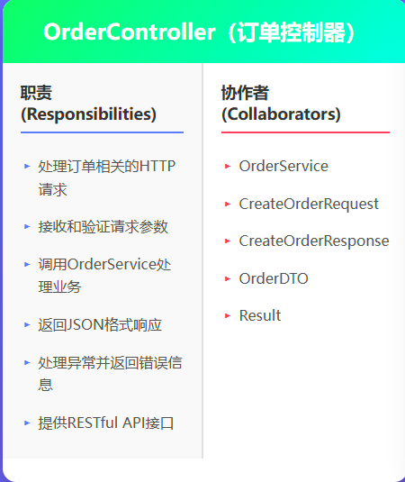
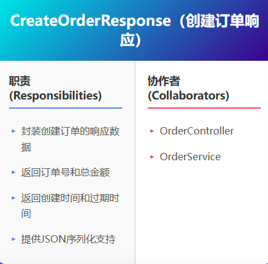
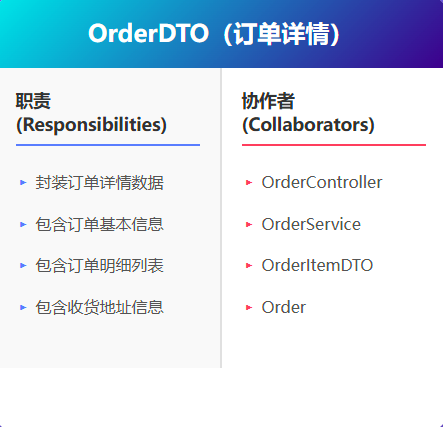
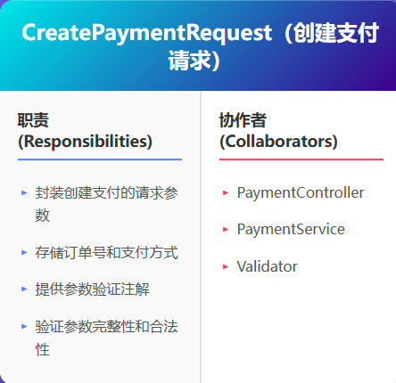
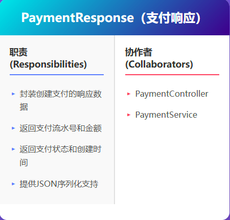
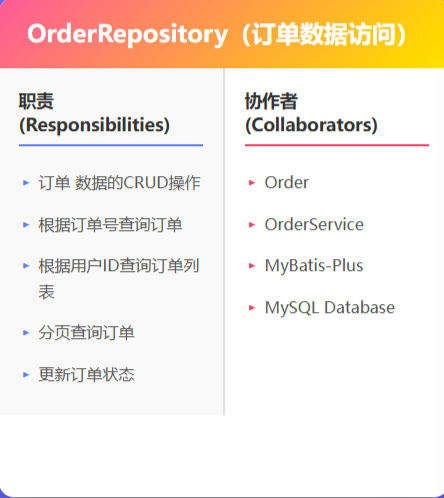
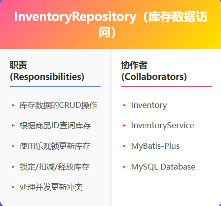
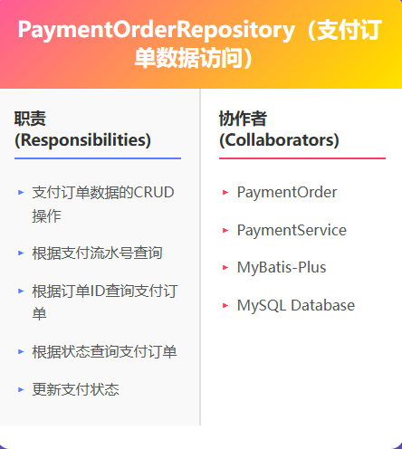
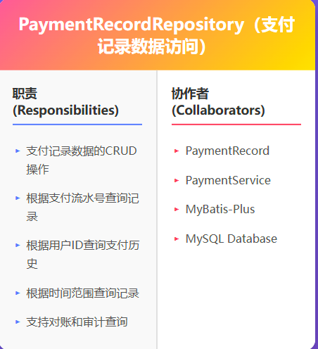

# CRC卡片精化版
## 云原生微服务电商平台 - 基于分层架构的精化设计

**项目名称**：云原生微服务电商平台  
**当前迭代**：第一迭代（敏捷开发）  
**核心用例**：UC9（创建订单）、UC10（订单支付）  
**文档版本**：V2.0（精化版）  
**编写日期**：2025-11-23  
**文档性质**：CRC卡片精化设计文档

---

## 一、文档概述

### 1.1 精化目的

本文档是对原有CRC卡片的精化版本，基于[`12.类的精化设计文档.md`](12.类的精化设计文档.md)中的四层架构设计，新增了14个精化后的类的CRC卡片，包括：
- **表示层**：Controller类和DTO类
- **数据访问层**：Repository类

### 1.2 与原版CRC卡片的关系

| 文档 | 类数量 | 包含内容 | 说明 |
|------|--------|---------|------|
| [`6.3UC9&UC10_CRC卡设计文档.md`](6.3UC9&UC10_CRC卡设计文档.md) | 17个 | 实体类、枚举类、控制类 | 原始分析阶段的CRC卡片 |
| **本文档（精化版）** | **14个** | **Controller、DTO、Repository** | **设计阶段新增的精化类** |
| **总计** | **31个** | **完整的四层架构** | **分析阶段17个 + 精化阶段14个** |

### 1.3 CRC卡片分类

本文档包含的14个精化类CRC卡片分为三大类：

1. **边界类（Controller）** - 2个
   - OrderController
   - PaymentController

2. **数据传输对象（DTO）** - 8个
   - CreateOrderRequest
   - CreateOrderResponse
   - OrderDTO
   - OrderItemDTO
   - CreatePaymentRequest
   - PaymentResponse
   - PaymentStatusDTO
   - PaymentPageData

3. **数据访问类（Repository）** - 4个
   - OrderRepository
   - InventoryRepository
   - PaymentOrderRepository
   - PaymentRecordRepository

---

## 二、表示层 - Controller类（2个）

### 2.1 OrderController - 订单控制器

**类型**：边界类（Boundary）  
**层次**：表示层（Presentation Layer）  
**职责**：
- 处理订单相关的HTTP请求
- 参数验证和转换
- 调用OrderService处理业务逻辑
- 返回JSON响应

**协作者**：
- OrderService（业务逻辑层）
- CreateOrderRequest（DTO）
- CreateOrderResponse（DTO）
- OrderDetailResponse（DTO）

**关键方法**：
- `createOrder()` - 创建订单
- `getOrderDetail()` - 查询订单详情
- `cancelOrder()` - 取消订单
- `getUserOrders()` - 查询用户订单列表
- `updateOrderStatus()` - 更新订单状态

---

### 2.2 PaymentController - 支付控制器

**类型**：边界类（Boundary）  
**层次**：表示层（Presentation Layer）  
**职责**：
- 处理支付相关的HTTP请求
- 参数验证和转换
- 调用PaymentService处理业务逻辑
- 返回JSON响应

**协作者**：
- PaymentService（业务逻辑层）
- CreatePaymentRequest（DTO）
- PaymentResponse（DTO）
- PaymentStatusDTO（DTO）
- PaymentPageData（DTO）

**关键方法**：
- `createPayment()` - 创建支付订单
- `getPaymentPage()` - 获取支付页面数据
- `queryPaymentStatus()` - 查询支付状态
- `handleCallback()` - 处理支付回调

---

## 三、表示层 - DTO类（8个）

### 3.1 订单相关DTO（4个）

#### 3.1.1 CreateOrderRequest - 创建订单请求DTO

**类型**：数据传输对象（DTO）  
**层次**：表示层（Presentation Layer）  
**职责**：
- 封装创建订单的请求参数
- 使用Jakarta Validation进行参数校验

**属性**：
- `userId` - 用户ID（@NotNull）
- `cartItemIds` - 购物车项ID列表（@NotEmpty）
- `addressId` - 收货地址ID（@NotNull）
- `remark` - 订单备注（可选，最长500字符）

**协作者**：
- OrderController（接收请求）
- OrderService（传递参数）

---

#### 3.1.2 CreateOrderResponse - 创建订单响应DTO

**类型**：数据传输对象（DTO）  
**层次**：表示层（Presentation Layer）  
**职责**：
- 封装创建订单成功后的响应数据
- 返回订单关键信息供前端展示

**属性**：
- `orderNumber` - 订单号
- `totalAmount` - 订单总金额
- `createTime` - 创建时间
- `expireTime` - 过期时间
- `status` - 订单状态

**协作者**：
- OrderController（返回响应）
- OrderService（提供数据）

---

#### 3.1.3 OrderDTO - 订单详情DTO

**类型**：数据传输对象（DTO）  
**层次**：表示层（Presentation Layer）  
**职责**：
- 封装完整的订单详情信息
- 包含订单基本信息、收货地址、订单明细列表

**属性**：
- 订单基本信息（orderNumber, userId, status等）
- 金额信息（totalAmount, paymentAmount等）
- 时间信息（createTime, payTime, expireTime等）
- 收货地址（ShippingAddressDTO）
- 订单明细列表（List<OrderItemDTO>）
- 备注信息（remark）

**协作者**：
- OrderController（返回响应）
- OrderItemDTO（订单明细）
- ShippingAddressDTO（收货地址）

---

#### 3.1.4 OrderItemDTO - 订单明细DTO

**类型**：数据传输对象（DTO）  
**层次**：表示层（Presentation Layer）  
**职责**：
- 封装订单明细信息
- 包含商品快照数据

**属性**：
- `orderItemId` - 订单明细ID
- `productId` - 商品ID
- `productName` - 商品名称（快照）
- `productImage` - 商品图片（快照）
- `productPrice` - 商品单价（快照）
- `quantity` - 购买数量
- `subtotal` - 小计金额

**协作者**：
- OrderDTO（订单详情）
- OrderController（数据转换）

---

### 3.2 支付相关DTO（4个）

#### 3.2.1 CreatePaymentRequest - 创建支付请求DTO

**类型**：数据传输对象（DTO）  
**层次**：表示层（Presentation Layer）  
**职责**：
- 封装创建支付的请求参数
- 使用Jakarta Validation进行参数校验

**属性**：
- `orderNumber` - 订单号（@NotBlank）
- `paymentMethod` - 支付方式（@NotBlank）
  - ALIPAY - 支付宝
  - WECHAT - 微信支付
  - MOCK - 模拟支付

**协作者**：
- PaymentController（接收请求）
- PaymentService（传递参数）

---

#### 3.2.2 PaymentResponse - 支付响应DTO

**类型**：数据传输对象（DTO）  
**层次**：表示层（Presentation Layer）  
**职责**：
- 封装支付响应数据
- 返回支付订单关键信息

**属性**：
- `paymentNumber` - 支付单号
- `amount` - 支付金额
- `status` - 支付状态
- `createTime` - 创建时间
- `paymentUrl` - 支付URL（第三方支付页面）

**协作者**：
- PaymentController（返回响应）
- PaymentService（提供数据）

---

#### 3.2.3 PaymentStatusDTO - 支付状态查询DTO

**类型**：数据传输对象（DTO）  
**层次**：表示层（Presentation Layer）  
**职责**：
- 封装支付状态查询结果
- 用于前端轮询查询支付状态

**属性**：
- `paymentNumber` - 支付单号
- `status` - 支付状态（PENDING/SUCCESS/FAILED）
- `payTime` - 支付时间
- `message` - 状态描述信息

**协作者**：
- PaymentController（返回响应）
- PaymentService（提供数据）

---

#### 3.2.4 PaymentPageData - 支付页面数据DTO

**类型**：数据传输对象（DTO）  
**层次**：表示层（Presentation Layer）  
**职责**：
- 封装支付页面所需的数据
- 包含订单信息和支付方式列表

**属性**：
- `orderNumber` - 订单号
- `orderAmount` - 订单金额
- `orderCreateTime` - 订单创建时间
- `orderExpireTime` - 订单过期时间
- `availablePaymentMethods` - 可用支付方式列表
- `orderItems` - 订单明细列表（简化版）

**协作者**：
- PaymentController（返回响应）
- PaymentService（提供数据）
- OrderService（查询订单信息）

---

## 四、数据访问层 - Repository类（4个）

### 4.1 订单服务Repository（2个）

#### 4.1.1 OrderRepository - 订单数据访问接口

**类型**：数据访问类（Repository）  
**层次**：数据访问层（Data Access Layer）  
**职责**：
- 订单数据的CRUD操作
- 使用MyBatis-Plus的BaseMapper接口
- 封装数据库访问逻辑

**继承**：
- `BaseMapper<Order>` - MyBatis-Plus基础接口

**核心方法**：
- `insert()` - 插入订单
- `selectById()` - 根据ID查询
- `updateById()` - 根据ID更新
- `deleteById()` - 根据ID删除
- `findByOrderNumber()` - 根据订单号查询
- `findByUserId()` - 根据用户ID查询
- `findByUserIdAndStatus()` - 根据用户ID和状态查询
- `findByUserIdWithPage()` - 分页查询用户订单

**协作者**：
- OrderService（业务逻辑层）
- Order（实体类）
- MySQL数据库（order_db.orders表）

---

#### 4.1.2 InventoryRepository - 库存数据访问接口

**类型**：数据访问类（Repository）  
**层次**：数据访问层（Data Access Layer）  
**职责**：
- 库存数据的CRUD操作
- 支持乐观锁更新
- 封装库存操作的SQL逻辑

**继承**：
- `BaseMapper<Inventory>` - MyBatis-Plus基础接口

**核心方法**：
- `findByProductId()` - 根据商品ID查询库存
- `lockStock()` - 锁定库存（预扣）
- `deductStock()` - 扣减库存（实际扣减）
- `releaseStock()` - 释放库存（取消订单）
- `updateWithOptimisticLock()` - 使用乐观锁更新库存

**协作者**：
- InventoryService（业务逻辑层）
- Inventory（实体类）
- MySQL数据库（order_db.inventory表）

**技术特点**：
- 使用version字段实现乐观锁
- 防止库存超卖问题
- 支持并发安全的库存操作

---

### 4.2 支付服务Repository（2个）

#### 4.2.1 PaymentOrderRepository - 支付订单数据访问接口

**类型**：数据访问类（Repository）  
**层次**：数据访问层（Data Access Layer）  
**职责**：
- 支付订单数据的CRUD操作
- 使用MyBatis-Plus的BaseMapper接口
- 封装支付订单数据库访问逻辑

**继承**：
- `BaseMapper<PaymentOrder>` - MyBatis-Plus基础接口

**核心方法**：
- `insert()` - 插入支付订单
- `selectById()` - 根据ID查询
- `updateById()` - 根据ID更新
- `findByPaymentNumber()` - 根据支付单号查询
- `findByOrderId()` - 根据订单ID查询
- `findByStatus()` - 根据状态查询

**协作者**：
- PaymentService（业务逻辑层）
- PaymentOrder（实体类）
- MySQL数据库（payment_db.payment_orders表）

---

#### 4.2.2 PaymentRecordRepository - 支付记录数据访问接口

**类型**：数据访问类（Repository）  
**层次**：数据访问层（Data Access Layer）  
**职责**：
- 支付记录数据的CRUD操作
- 支持支付历史查询
- 用于审计和对账

**继承**：
- `BaseMapper<PaymentRecord>` - MyBatis-Plus基础接口

**核心方法**：
- `insert()` - 插入支付记录
- `selectById()` - 根据ID查询
- `findByPaymentNumber()` - 根据支付单号查询
- `findByUserId()` - 根据用户ID查询
- `findByOrderId()` - 根据订单ID查询
- `findByUserIdAndTimeRange()` - 根据用户ID和时间范围查询

**协作者**：
- PaymentService（业务逻辑层）
- PaymentCallbackHandler（回调处理）
- PaymentRecord（实体类）
- MySQL数据库（payment_db.payment_records表）

**技术特点**：
- 记录每次支付操作的详细信息
- 支持审计和对账功能
- 保留完整的支付历史记录

---

## 五、CRC卡片统计

### 5.1 按类型统计

| 类型 | 数量 | 类名列表 |
|------|------|---------|
| **Controller（边界类）** | 2 | OrderController, PaymentController |
| **DTO（数据传输对象）** | 8 | CreateOrderRequest, CreateOrderResponse, OrderDTO, OrderItemDTO, CreatePaymentRequest, PaymentResponse, PaymentStatusDTO, PaymentPageData |
| **Repository（数据访问类）** | 4 | OrderRepository, InventoryRepository, PaymentOrderRepository, PaymentRecordRepository |
| **总计** | **14** | - |

### 5.2 按服务统计

| 服务 | Controller | DTO | Repository | 小计 |
|------|-----------|-----|-----------|------|
| **订单服务** | 1 | 4 | 2 | 7 |
| **支付服务** | 1 | 4 | 2 | 7 |
| **总计** | **2** | **8** | **4** | **14** |

### 5.3 完整类统计（分析阶段 + 精化阶段）

| 阶段 | 文档 | 类数量 | 类型 |
|------|------|--------|------|
| **分析阶段** | 6.3UC9&UC10_CRC卡设计文档.md | 17 | 实体类、枚举类、控制类 |
| **精化阶段** | 本文档（12.crc卡片精化版.md） | 14 | Controller、DTO、Repository |
| **总计** | - | **31** | **完整的四层架构** |

---

## 六、设计依据

本文档严格遵循以下设计文档：

1. [`12.类的精化设计文档.md`](12.类的精化设计文档.md) - 类的精化设计
   - 第四章：新增类详细说明
   - 第五章：精化后的类图

2. [`11.体系结构决策描述文档.md`](11.体系结构决策描述文档.md) - 架构决策
   - 决策1：分层架构
   - 决策2：MVC模式

3. [`15.接口设计文档.md`](15.接口设计文档.md) - 接口设计
   - Controller接口规范
   - DTO设计规范

4. [`14.数据持久化设计文档.md`](14.数据持久化设计文档.md) - 数据持久化设计
   - Repository接口设计
   - MyBatis-Plus配置

---

## 七、CRC卡片使用说明

### 7.1 如何阅读CRC卡片

**CRC卡片包含三个部分**：
1. **Class（类名）**：类的名称和类型
2. **Responsibility（职责）**：类的主要职责和功能
3. **Collaborator（协作者）**：与该类协作的其他类

### 7.2 CRC卡片的作用

1. **设计阶段**：
   - 帮助识别类的职责
   - 明确类之间的协作关系
   - 避免职责过重或过轻

2. **开发阶段**：
   - 指导类的实现
   - 明确类的接口和依赖
   - 保持类的单一职责

3. **评审阶段**：
   - 检查设计的合理性
   - 评估类的职责划分
   - 优化类的协作关系

### 7.3 与代码实现的对应

| CRC卡片元素 | 代码实现 |
|------------|---------|
| **类名** | Java类名 |
| **职责** | 类的方法和业务逻辑 |
| **协作者** | 类的依赖注入和方法调用 |

---

## 八、总结

### 8.1 精化成果

✅ **完成了14个精化类的CRC卡片设计**：
- 2个Controller类（表示层）
- 8个DTO类（数据传输）
- 4个Repository类（数据访问层）

✅ **形成了完整的四层架构CRC卡片体系**：
- 分析阶段：17个类（实体、枚举、控制）
- 精化阶段：14个类（Controller、DTO、Repository）
- 总计：31个类

### 8.2 设计特点

🌟 **职责清晰**：
- Controller负责HTTP请求处理
- DTO负责数据传输
- Repository负责数据访问

🌟 **协作明确**：
- 每个类的协作者都清晰标注
- 层间依赖关系明确
- 符合分层架构原则

🌟 **可视化展示**：
- 每个类都有对应的CRC卡片图片
- 便于理解和沟通
- 支持设计评审

### 8.3 下一步工作

1. ✅ CRC卡片精化设计已完成
2. ⏭️ 基于CRC卡片进行代码实现
3. ⏭️ 编写单元测试验证类的职责
4. ⏭️ 进行设计评审和优化

---

## 九、参考文档

1. [`6.3UC9&UC10_CRC卡设计文档.md`](6.3UC9&UC10_CRC卡设计文档.md) - 原始CRC卡片（17个类）
2. [`12.类的精化设计文档.md`](12.类的精化设计文档.md) - 类的精化设计
3. [`11.体系结构决策描述文档.md`](11.体系结构决策描述文档.md) - 架构决策
4. [`15.接口设计文档.md`](15.接口设计文档.md) - 接口设计
5. [`14.数据持久化设计文档.md`](14.数据持久化设计文档.md) - 数据持久化设计

---

**文档版本**：V2.0（精化版）  
**文档状态**：CRC卡片精化设计已完成  
**编写日期**：2025-11-23  
**下一步工作**：基于CRC卡片进行代码实现  

**文档结束**