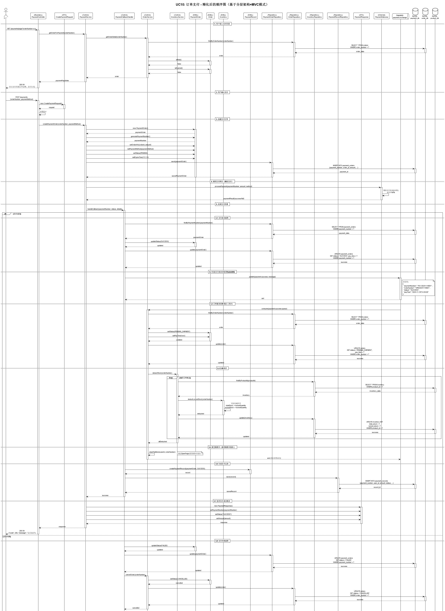

# UC9 & UC10 类的精化设计文档
## 云原生微服务电商平台 - 基于分层架构+MVC模式

**项目名称**：云原生微服务电商平台  
**当前迭代**：第一迭代（敏捷开发）  
**核心用例**：UC9（创建订单）、UC10（订单支付）  
**架构模式**：分层架构 + MVC模式  
**编写日期**：2025-11-18  
**文档版本**：V1.0

---

## 一、类的精化概述

### 1.1 精化目的

基于前期的类分析（6.1.1类的分析.md）、类图设计（6.2类图设计.md）和体系结构决策（11.体系结构决策描述文档.md），对原有的17个分析类进行精化，使其符合**分层架构**和**MVC模式**的设计要求。

### 1.2 精化依据

- **决策1**：订单服务和支付服务采用分层架构风格（表示层、业务逻辑层、数据访问层）
- **决策2**：表示层采用MVC模式（Controller + DTO，无View层）
- **决策9**：使用MySQL + MyBatis-Plus进行数据持久化

### 1.3 精化原则

1. **职责分离**：每层只负责特定的职责，不跨层调用
2. **依赖方向**：上层依赖下层，下层不依赖上层
3. **接口隔离**：通过接口定义层间交互
4. **数据传输**：使用DTO在层间传递数据

---

## 二、精化前后对比

### 2.1 原有分析类（17个）

| 类型 | 数量 | 类名 |
|------|------|------|
| **实体类** | 10 | User, Order, OrderItem, Product, ShoppingCart, CartItem, ShippingAddress, Inventory, PaymentOrder, PaymentRecord |
| **枚举类** | 3 | OrderStatus, PaymentStatus, PaymentMethod |
| **控制类** | 4 | OrderService, InventoryService, PaymentService, PaymentCallbackHandler |
| **总计** | **17** | - |

### 2.2 精化后的类（31个）

| 类型 | 数量 | 新增类 | 说明 |
|------|------|--------|------|
| **边界类（Boundary）** | 2 | OrderController, PaymentController | 表示层，处理HTTP请求 |
| **实体类（Entity）** | 10 | 保持不变 | 领域层，业务对象 |
| **控制类（Control）** | 4 | 保持不变 | 业务逻辑层，Service |
| **数据访问类（Repository）** | 4 | OrderRepository, PaymentOrderRepository, PaymentRecordRepository, InventoryRepository | 数据访问层 |
| **DTO类** | 8 | CreateOrderRequest, CreateOrderResponse, OrderDTO, CreatePaymentRequest, PaymentResponse, PaymentStatusDTO, OrderItemDTO, PaymentPageData | 数据传输对象 |
| **枚举类** | 3 | 保持不变 | 状态和类型枚举 |
| **总计** | **31** | **新增14个类** | - |

---

## 三、分层架构设计

### 3.1 四层架构

```
┌─────────────────────────────────────────────┐
│         表示层 (Presentation Layer)          │
│  - OrderController, PaymentController       │
│  - DTO: Request/Response对象                │
├─────────────────────────────────────────────┤
│       业务逻辑层 (Business Logic Layer)      │
│  - OrderService, PaymentService             │
│  - InventoryService, PaymentCallbackHandler │
├─────────────────────────────────────────────┤
│          领域层 (Domain Layer)               │
│  - Entity: Order, PaymentOrder, Inventory   │
│  - Enum: OrderStatus, PaymentStatus         │
├─────────────────────────────────────────────┤
│       数据访问层 (Data Access Layer)         │
│  - Repository: OrderRepository, etc.        │
│  - MyBatis-Plus, MySQL                      │
└─────────────────────────────────────────────┘
```

### 3.2 层间依赖关系

| 调用方 | 被调用方 | 依赖类型 | 说明 |
|--------|---------|---------|------|
| Controller | Service | 依赖注入 | 表示层调用业务逻辑层 |
| Service | Repository | 依赖注入 | 业务逻辑层调用数据访问层 |
| Service | Entity | 创建/使用 | 业务逻辑层操作领域对象 |
| Repository | Entity | 持久化 | 数据访问层持久化实体 |
| Controller | DTO | 使用 | 表示层使用DTO传输数据 |

---

## 四、新增类详细说明

### 4.1 边界类（Boundary/Controller）

#### 4.1.1 OrderController

**职责**：
- 处理订单相关的HTTP请求
- 参数验证和转换
- 调用OrderService处理业务逻辑
- 返回JSON响应

**主要方法**：
```java
@RestController
@RequestMapping("/orders")
public class OrderController {
    @Autowired
    private OrderService orderService;
    
    // 准备订单确认页面数据
    @GetMapping("/prepare")
    public ResponseEntity<OrderConfirmData> prepareOrder(
        @RequestParam Long userId,
        @RequestParam List<Long> cartItemIds
    );
    
    // 创建订单
    @PostMapping
    public ResponseEntity<CreateOrderResponse> createOrder(
        @RequestBody @Valid CreateOrderRequest request
    );
    
    // 查询订单详情
    @GetMapping("/{orderNumber}")
    public ResponseEntity<OrderDTO> getOrderDetail(
        @PathVariable String orderNumber
    );
    
    // 查询用户订单列表
    @GetMapping("/user/{userId}")
    public ResponseEntity<Page<OrderDTO>> getUserOrders(
        @PathVariable Long userId,
        @RequestParam(required = false) String status,
        @RequestParam(defaultValue = "1") int page,
        @RequestParam(defaultValue = "10") int size
    );
    
    // 取消订单
    @PutMapping("/{orderNumber}/cancel")
    public ResponseEntity<Void> cancelOrder(
        @PathVariable String orderNumber
    );
}
```

#### 4.1.2 PaymentController

**职责**：
- 处理支付相关的HTTP请求
- 参数验证和转换
- 调用PaymentService处理业务逻辑
- 返回JSON响应

**主要方法**：
```java
@RestController
@RequestMapping("/payments")
public class PaymentController {
    @Autowired
    private PaymentService paymentService;
    
    // 获取支付页面数据
    @GetMapping("/page")
    public ResponseEntity<PaymentPageData> getPaymentPage(
        @RequestParam String orderNumber
    );
    
    // 创建支付订单
    @PostMapping
    public ResponseEntity<PaymentResponse> createPayment(
        @RequestBody @Valid CreatePaymentRequest request
    );
    
    // 查询支付状态
    @GetMapping("/{paymentNumber}/status")
    public ResponseEntity<PaymentStatusDTO> queryPaymentStatus(
        @PathVariable String paymentNumber
    );
    
    // 处理支付回调
    @PostMapping("/callback")
    public ResponseEntity<Void> handleCallback(
        @RequestBody PaymentCallbackData callbackData
    );
}
```

---

### 4.2 数据访问类（Repository）

#### 4.2.1 OrderRepository

**职责**：
- 订单数据的CRUD操作
- 使用MyBatis-Plus的BaseMapper接口
- 封装数据库访问逻辑

**接口定义**：
```java
@Mapper
public interface OrderRepository extends BaseMapper<Order> {
    // 继承BaseMapper的基本CRUD方法
    // - insert(Order order)
    // - selectById(Long id)
    // - updateById(Order order)
    // - deleteById(Long id)
    
    // 自定义查询方法
    Order findByOrderNumber(String orderNumber);
    List<Order> findByUserId(Long userId);
    List<Order> findByUserIdAndStatus(Long userId, OrderStatus status);
    Page<Order> findByUserIdWithPage(Long userId, IPage<Order> page);
}
```

#### 4.2.2 PaymentOrderRepository

**职责**：
- 支付订单数据的CRUD操作
- 使用MyBatis-Plus的BaseMapper接口

**接口定义**：
```java
@Mapper
public interface PaymentOrderRepository extends BaseMapper<PaymentOrder> {
    PaymentOrder findByPaymentNumber(String paymentNumber);
    PaymentOrder findByOrderId(Long orderId);
    List<PaymentOrder> findByStatus(PaymentStatus status);
}
```

#### 4.2.3 PaymentRecordRepository

**职责**：
- 支付记录数据的CRUD操作
- 支持支付历史查询

**接口定义**：
```java
@Mapper
public interface PaymentRecordRepository extends BaseMapper<PaymentRecord> {
    List<PaymentRecord> findByPaymentNumber(String paymentNumber);
    List<PaymentRecord> findByUserId(Long userId);
    List<PaymentRecord> findByOrderId(Long orderId);
    List<PaymentRecord> findByUserIdAndTimeRange(
        Long userId, 
        LocalDateTime startTime, 
        LocalDateTime endTime
    );
}
```

#### 4.2.4 InventoryRepository

**职责**：
- 库存数据的CRUD操作
- 支持乐观锁更新

**接口定义**：
```java
@Mapper
public interface InventoryRepository extends BaseMapper<Inventory> {
    Inventory findByProductId(Long productId);
    
    // 使用乐观锁更新库存
    @Update("UPDATE inventory SET " +
            "available_stock = #{availableStock}, " +
            "locked_stock = #{lockedStock}, " +
            "version = version + 1 " +
            "WHERE product_id = #{productId} " +
            "AND version = #{version}")
    int updateWithOptimisticLock(Inventory inventory);
}
```

---

### 4.3 DTO类（Data Transfer Object）

#### 4.3.1 CreateOrderRequest

**职责**：封装创建订单的请求参数

```java
@Data
public class CreateOrderRequest {
    @NotNull(message = "用户ID不能为空")
    private Long userId;
    
    @NotEmpty(message = "购物车项不能为空")
    private List<Long> cartItemIds;
    
    @NotNull(message = "收货地址ID不能为空")
    private Long addressId;
    
    @Size(max = 500, message = "备注不能超过500字符")
    private String remark;
}
```

#### 4.3.2 CreateOrderResponse

**职责**：封装创建订单的响应数据

```java
@Data
public class CreateOrderResponse {
    private String orderNumber;
    private BigDecimal totalAmount;
    private LocalDateTime createTime;
    private LocalDateTime expireTime;
}
```

#### 4.3.3 OrderDTO

**职责**：封装订单详情数据

```java
@Data
public class OrderDTO {
    private String orderNumber;
    private Long userId;
    private BigDecimal totalAmount;
    private String status;
    private List<OrderItemDTO> items;
    private String recipientName;
    private String recipientPhone;
    private String shippingAddress;
    private LocalDateTime createTime;
    private LocalDateTime payTime;
}
```

#### 4.3.4 CreatePaymentRequest

**职责**：封装创建支付的请求参数

```java
@Data
public class CreatePaymentRequest {
    @NotBlank(message = "订单号不能为空")
    private String orderNumber;
    
    @NotBlank(message = "支付方式不能为空")
    private String paymentMethod; // ALIPAY, WECHAT, MOCK
}
```

#### 4.3.5 PaymentResponse

**职责**：封装支付响应数据

```java
@Data
public class PaymentResponse {
    private String paymentNumber;
    private BigDecimal amount;
    private String status;
    private LocalDateTime createTime;
}
```

#### 4.3.6 PaymentStatusDTO

**职责**：封装支付状态查询结果

```java
@Data
public class PaymentStatusDTO {
    private String paymentNumber;
    private String status; // PENDING, SUCCESS, FAILED
    private LocalDateTime payTime;
}
```

---

## 五、精化后的类图

### 5.1 PlantUML文件

**文件路径**：`out/类图UML/RefinedClassDiagram/RefinedClassDiagram.png`

**类图展示**：


> 💡 **PlantUML源文件**：[`类图UML/RefinedClassDiagram.puml`](类图UML/RefinedClassDiagram.puml)

**类图特点**：
1. ✅ 清晰展示四层架构（表示层、业务逻辑层、领域层、数据访问层）
2. ✅ 使用不同颜色区分不同类型的类
3. ✅ 标注类的构造型（<<Boundary>>, <<Control>>, <<Entity>>, <<Repository>>, <<DTO>>）
4. ✅ 展示层间依赖关系
5. ✅ 包含注释说明每层的职责

### 5.2 类统计

| 层次 | 类型 | 数量 | 类名 |
|------|------|------|------|
| **表示层** | Boundary | 2 | OrderController, PaymentController |
| **表示层** | DTO | 8 | CreateOrderRequest, CreateOrderResponse, OrderDTO, CreatePaymentRequest, PaymentResponse, PaymentStatusDTO, OrderItemDTO, PaymentPageData |
| **业务逻辑层** | Control | 4 | OrderService, InventoryService, PaymentService, PaymentCallbackHandler |
| **领域层** | Entity | 10 | User, Order, OrderItem, Product, ShoppingCart, CartItem, ShippingAddress, Inventory, PaymentOrder, PaymentRecord |
| **领域层** | Enum | 3 | OrderStatus, PaymentStatus, PaymentMethod |
| **数据访问层** | Repository | 4 | OrderRepository, PaymentOrderRepository, PaymentRecordRepository, InventoryRepository |
| **总计** | - | **31** | - |

---

## 六、精化后的顺序图

### 6.1 UC9创建订单顺序图

**文件路径**：`out/类图UML/UC9_Refined_Sequence/UC9_Refined_Sequence.png`

**顺序图展示**：


> 💡 **PlantUML源文件**：[`类图UML/UC9_Refined_Sequence.puml`](类图UML/UC9_Refined_Sequence.puml)

**顺序图特点**：
1. ✅ 展示完整的分层调用流程（Controller → Service → Repository → Database）
2. ✅ 包含DTO的创建和使用
3. ✅ 展示数据库交互（SQL语句）
4. ✅ 包含异常处理流程（库存不足、库存锁定失败）
5. ✅ 展示乐观锁的使用
6. ✅ 标注Seata分布式事务

**主要流程**：
1. 用户提交订单 → OrderController接收请求
2. Controller创建CreateOrderRequest DTO
3. Controller调用OrderService.createOrder()
4. OrderService调用InventoryService校验库存
5. InventoryService通过InventoryRepository查询数据库
6. OrderService创建Order和OrderItem实体
7. OrderService调用InventoryService预扣库存（乐观锁）
8. OrderService通过OrderRepository保存订单到数据库
9. OrderService创建CreateOrderResponse DTO
10. Controller返回JSON响应给用户

### 6.2 UC10订单支付顺序图

**文件路径**：`out/类图UML/UC10_Refined_Sequence/UC10_Refined_Sequence.png`

**顺序图展示**：



> 💡 **PlantUML源文件**：[`类图UML/UC10_Refined_Sequence.puml`](类图UML/UC10_Refined_Sequence.puml)

**顺序图特点**：
1. ✅ 展示完整的支付流程（创建支付订单 → 调用支付网关 → 处理回调）
2. ✅ 展示RabbitMQ异步消息传递
3. ✅ 展示支付成功和失败两种场景
4. ✅ 展示订单服务消费消息的流程
5. ✅ 展示库存扣减和释放的逻辑
6. ✅ 包含数据库交互

**主要流程**：
1. 用户进入支付页面 → PaymentController获取支付信息
2. 用户确认支付 → PaymentController接收请求
3. Controller创建CreatePaymentRequest DTO
4. Controller调用PaymentService.createPaymentOrder()
5. PaymentService创建PaymentOrder实体并保存到数据库
6. PaymentService调用PaymentGateway模拟支付
7. PaymentService调用PaymentCallbackHandler处理回调
8. **支付成功分支**：
   - CallbackHandler更新PaymentOrder状态
   - CallbackHandler发送消息到RabbitMQ
   - OrderService消费消息，更新Order状态
   - OrderService调用InventoryService扣减库存
   - OrderService清空购物车
   - CallbackHandler创建PaymentRecord
9. **支付失败分支**：
   - CallbackHandler更新PaymentOrder状态为FAILED
   - CallbackHandler调用OrderService取消订单
   - CallbackHandler调用InventoryService释放库存
   - CallbackHandler创建PaymentRecord

---

## 七、精化设计的优势

### 7.1 职责清晰

| 层次 | 职责 | 优势 |
|------|------|------|
| **表示层** | 处理HTTP请求，参数验证，返回响应 | 易于测试，可以mock Service层 |
| **业务逻辑层** | 业务规则，事务管理，服务编排 | 业务逻辑集中，易于维护 |
| **领域层** | 领域对象，业务规则 | 符合DDD思想，业务语义清晰 |
| **数据访问层** | 数据持久化，CRUD操作 | 数据访问逻辑封装，易于切换ORM框架 |

### 7.2 易于测试

```java
// 单元测试示例：测试OrderService
@SpringBootTest
public class OrderServiceTest {
    @Autowired
    private OrderService orderService;
    
    @MockBean
    private OrderRepository orderRepository;
    
    @MockBean
    private InventoryService inventoryService;
    
    @Test
    public void testCreateOrder() {
        // 准备测试数据
        CreateOrderRequest request = new CreateOrderRequest();
        request.setUserId(1L);
        request.setCartItemIds(Arrays.asList(1L, 2L));
        request.setAddressId(1L);
        
        // Mock依赖
        when(inventoryService.batchCheckStock(any()))
            .thenReturn(Collections.emptyMap());
        when(orderRepository.save(any()))
            .thenReturn(mockOrder);
        
        // 执行测试
        Order order = orderService.createOrder(request);
        
        // 验证结果
        assertNotNull(order);
        assertEquals("PENDING_PAYMENT", order.getStatus());
    }
}
```

### 7.3 易于扩展

**场景1：新增支付方式**
- 只需在PaymentMethod枚举中添加新的支付方式
- 在PaymentService中添加对应的处理逻辑
- 不影响其他层

**场景2：切换ORM框架**
- 只需修改Repository层的实现
- 不影响Service层和Controller层

**场景3：新增订单状态**
- 只需在OrderStatus枚举中添加新状态
- 在OrderService中添加状态转换逻辑
- 不影响其他层

### 7.4 符合SOLID原则

| 原则 | 体现 |
|------|------|
| **单一职责原则（SRP）** | 每个类只负责一个职责（Controller处理请求，Service处理业务，Repository处理数据） |
| **开闭原则（OCP）** | 对扩展开放（可以新增Service），对修改关闭（不影响现有代码） |
| **里氏替换原则（LSP）** | Repository接口可以有多种实现（MyBatis-Plus、JPA） |
| **接口隔离原则（ISP）** | Repository接口只定义必要的方法 |
| **依赖倒置原则（DIP）** | 上层依赖接口，不依赖具体实现 |

---

## 八、与原有类图的对比

### 8.1 原有类图（6.2类图设计.md）

**特点**：
- 17个类，主要关注领域模型
- 没有明确的分层结构
- 缺少Controller和Repository
- 缺少DTO

**适用场景**：
- 需求分析阶段
- 理解业务领域模型
- 识别核心实体和关系

### 8.2 精化后的类图

**特点**：
- 31个类，完整的分层架构
- 清晰的层次结构（表示层、业务逻辑层、领域层、数据访问层）
- 包含Controller、Repository、DTO
- 符合MVC模式

**适用场景**：
- 详细设计阶段
- 指导编码实现
- 代码生成
- 架构评审

---

## 九、实现建议

### 9.1 开发顺序

1. **第一步：创建实体类和枚举类**（领域层）
   - Order, OrderItem, PaymentOrder, PaymentRecord, Inventory
   - OrderStatus, PaymentStatus, PaymentMethod

2. **第二步：创建Repository接口**（数据访问层）
   - OrderRepository, PaymentOrderRepository, PaymentRecordRepository, InventoryRepository
   - 配置MyBatis-Plus

3. **第三步：创建Service类**（业务逻辑层）
   - OrderService, PaymentService, InventoryService, PaymentCallbackHandler
   - 实现业务逻辑

4. **第四步：创建DTO类**（表示层）
   - CreateOrderRequest, CreateOrderResponse, OrderDTO
   - CreatePaymentRequest, PaymentResponse, PaymentStatusDTO

5. **第五步：创建Controller类**（表示层）
   - OrderController, PaymentController
   - 实现RESTful API

6. **第六步：集成测试**
   - 单元测试
   - 集成测试
   - 端到端测试

### 9.2 技术栈

| 组件 | 技术选型 | 版本 |
|------|---------|------|
| 开发语言 | Java | 17+ |
| Web框架 | Spring Boot | 3.x |
| MVC框架 | Spring MVC | - |
| ORM框架 | MyBatis-Plus | 3.x |
| 数据库 | MySQL | 8.0 |
| 参数验证 | Hibernate Validator | - |
| JSON序列化 | Jackson | - |
| API文档 | Swagger/OpenAPI | 3.x |

### 9.3 代码规范

1. **命名规范**：
   - Controller类：以Controller结尾
   - Service类：以Service结尾
   - Repository接口：以Repository结尾
   - DTO类：以Request/Response/DTO结尾

2. **包结构**：
```
com.ecommerce.order
├── controller          # 表示层
│   ├── OrderController
│   └── dto
│       ├── CreateOrderRequest
│       └── CreateOrderResponse
├── service             # 业务逻辑层
│   ├── OrderService
│   └── InventoryService
├── domain              # 领域层
│   ├── entity
│   │   ├── Order
│   │   └── OrderItem
│   └── enums
│       └── OrderStatus
└── repository          # 数据访问层
    └── OrderRepository
```

3. **注解使用**：
   - Controller：`@RestController`, `@RequestMapping`
   - Service：`@Service`, `@Transactional`
   - Repository：`@Mapper`
   - DTO：`@Data`, `@NotNull`, `@Valid`

---

## 十、总结

### 10.1 精化成果

✅ **完成了类的精化工作**：
- 从17个分析类扩展到31个设计类
- 新增14个类（2个Controller、4个Repository、8个DTO）
- 形成完整的四层架构

✅ **生成了精化后的类图**：
- 文件：`类图UML/RefinedClassDiagram.puml`
- 清晰展示分层架构和类间关系
- 使用不同颜色和构造型区分类型

✅ **生成了精化后的顺序图**：
- UC9：`类图UML/UC9_Refined_Sequence.puml`
- UC10：`类图UML/UC10_Refined_Sequence.puml`
- 展示完整的分层调用流程
- 包含数据库交互和异步消息传递

### 10.2 设计质量

| 质量属性 | 评价 | 说明 |
|---------|------|------|
| **可维护性** | ⭐⭐⭐⭐⭐ | 职责清晰，易于理解和修改 |
| **可测试性** | ⭐⭐⭐⭐⭐ | 每层可以独立测试，易于mock |
| **可扩展性** | ⭐⭐⭐⭐⭐ | 符合开闭原则，易于扩展 |
| **可复用性** | ⭐⭐⭐⭐ | Service和Repository可以复用 |
| **性能** | ⭐⭐⭐⭐ | 分层调用有一定开销，但可接受 |

### 10.3 下一步工作

1. ✅ 类的精化设计已完成
2. ⏭️ 基于精化后的类图进行编码实现
3. ⏭️ 编写单元测试和集成测试
4. ⏭️ 部署到开发环境进行联调测试
5. ⏭️ 性能测试和优化

---

**文档版本**：V1.0  
**文档状态**：类的精化设计已完成  
**工作产品**：
- 精化后的类图：`类图UML/RefinedClassDiagram.puml`
- UC9精化顺序图：`类图UML/UC9_Refined_Sequence.puml`
- UC10精化顺序图：`类图UML/UC10_Refined_Sequence.puml`

