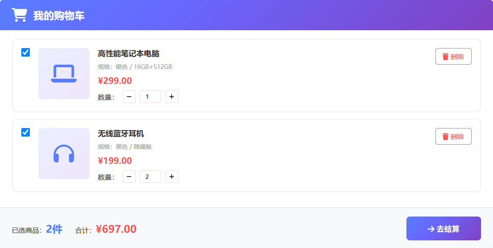

# 15. 接口设计文档

> **说明**：本文档基于UC9创建订单和UC10订单支付的场景建模、类图设计和顺序图，详细设计了系统的三类接口：UI界面接口、外部系统接口、构件接口。

## 构件接口关系图

下图展示了订单构件、支付构件、库存构件之间的接口调用关系，以及与外部系统的集成接口：


> **在线查看**：可以打开 [`类图UML/html查看/查看构件接口图.html`](类图UML/html查看/查看构件接口图.html) 在浏览器中查看高清矢量图。

## 文档信息

| 项目 | 内容 |
|------|------|
| 文档名称 | 接口设计文档 |
| 版本 | v1.0 |
| 创建日期 | 2025-11-18 |
| 作者 | 系统架构团队 |
| 适用范围 | UC9创建订单、UC10订单支付 |

---

## 1. 接口设计概述

接口设计包括三个方面：

1. **用户界面（UI）的设计**：利用场景建模中的工作产品结合UI设计原则
2. **系统与外部系统、设备等的外部接口**：考察场景模型，理清外部实体和系统间发送和接收的信息
3. **构件接口设计**：考察分析模型，定义构件之间的接口规范

---

## 2. 用户界面（UI）设计

> **在线查看UI原型**：可以打开 [`UI界面原型/订单支付界面原型.html`](UI界面原型/订单支付界面原型.html) 在浏览器中查看完整的交互式UI原型。

### 2.1 UI设计原则

基于场景建模中的活动图和用例描述，遵循以下UI设计原则：

- **简洁性**：界面简洁明了，减少用户认知负担
- **一致性**：保持界面风格、交互方式的一致性
- **反馈性**：及时给予用户操作反馈
- **容错性**：提供错误提示和恢复机制
- **响应式**：支持多终端适配（PC、移动端）

### 2.2 UC9创建订单 - UI界面设计

#### 2.2.1 购物车页面



**界面元素**：
- 商品列表展示（商品图片、名称、规格、单价）
- 商品选择复选框（支持全选）
- 数量调整按钮（加减按钮）
- 删除商品按钮
- 底部结算栏（已选商品数量、合计金额、去结算按钮）

**交互流程**：
1. 用户勾选商品
2. 点击"去结算"按钮
3. 跳转到订单确认页面

#### 2.2.2 订单确认页面


**界面元素**：
- 收货地址选择区域（支持多个地址，显示默认地址标签）
- 新增收货地址按钮
- 商品清单展示（商品图片、名称、数量、价格）
- 订单金额汇总（商品总额、运费、应付总额）
- 提交订单按钮

**交互流程**：
1. 选择收货地址（必选）
2. 确认商品清单
3. 查看订单金额
4. 点击"提交订单"按钮
5. 显示加载动画（库存校验、订单创建）
6. 成功后跳转到支付页面

#### 2.2.3 订单创建成功提示

**界面元素**：

```
┌─────────────────────────────────────────────────────────┐
│  ✓ 订单创建成功！                                        │
│                                                          │
│  订单号：ORD20251118001                                  │
│  订单金额：¥707.00                                       │
│  创建时间：2025-11-18 14:30:00                           │
│  支付剩余时间：29:59                                     │
│                                                          │
│  [立即支付]  [查看订单]                                  │
└─────────────────────────────────────────────────────────┘
```

### 2.3 UC10订单支付 - UI界面设计

#### 2.3.1 支付页面


**界面元素**：
- 订单信息展示（订单号、订单金额、支付剩余时间倒计时）
- 支付方式选择（支付宝、微信、银行卡，带图标和说明）
- 应付金额突出显示
- 确认支付按钮

**交互流程**：
1. 显示订单信息和倒计时
2. 选择支付方式（必选）
3. 点击"确认支付"按钮
4. 调用第三方支付网关
5. 显示支付处理中动画

#### 2.3.2 支付处理中页面

**界面元素**：

```
┌─────────────────────────────────────────────────────────┐
│                                                          │
│              [加载动画]                                  │
│                                                          │
│           支付处理中，请稍候...                          │
│                                                          │
│        请勿关闭页面或进行其他操作                        │
│                                                          │
└─────────────────────────────────────────────────────────┘
```

#### 2.3.3 支付成功页面


**界面元素**：
- 成功图标（绿色对勾）
- 支付成功提示文字
- 支付详情信息（支付金额、支付方式、支付时间、支付流水号）
- 温馨提示（发货时间）
- 操作按钮（查看订单详情、返回首页）

#### 2.3.4 支付失败页面


**界面元素**：
- 失败图标（红色叉号）
- 支付失败提示文字
- 失败原因说明（余额不足、网络超时、银行卡限额等）
- 订单信息（订单号、订单金额）
- 温馨提示（订单已取消，库存已释放）
- 操作按钮（重新下单、返回首页）

### 2.4 UI响应式设计

**移动端适配**：

- 使用响应式布局（Flexbox/Grid）
- 触摸友好的按钮尺寸（最小44×44px）
- 简化移动端界面元素
- 支持手势操作（滑动删除购物车商品）

---

## 3. 系统与外部接口设计

### 3.1 外部接口概述

根据场景模型和构件图，系统需要与以下外部实体交互：

1. **第三方支付网关**（支付宝、微信支付、银行支付）
2. **购物车服务**（获取购物车商品信息）
3. **商品服务**（获取商品详情、价格）
4. **用户服务**（获取用户信息、收货地址）
5. **消息队列**（RabbitMQ - 异步消息通信）

### 3.2 第三方支付网关接口

#### 3.2.1 支付宝支付接口

**接口名称**：Alipay Payment API

**接口类型**：REST API

**请求方式**：POST

**接口地址**：`https://openapi.alipay.com/gateway.do`

**请求参数**：

```json
{
  "app_id": "2021001234567890",
  "method": "alipay.trade.page.pay",
  "charset": "utf-8",
  "sign_type": "RSA2",
  "sign": "签名字符串",
  "timestamp": "2025-11-18 14:30:00",
  "version": "1.0",
  "notify_url": "https://api.example.com/payment/callback/alipay",
  "biz_content": {
    "out_trade_no": "PAY20251118001",
    "product_code": "FAST_INSTANT_TRADE_PAY",
    "total_amount": "707.00",
    "subject": "订单支付-ORD20251118001",
    "body": "商品名称1 × 1, 商品名称2 × 2",
    "timeout_express": "15m"
  }
}
```

**响应参数**：

```json
{
  "code": "10000",
  "msg": "Success",
  "trade_no": "2025111822001234567890123456",
  "out_trade_no": "PAY20251118001",
  "total_amount": "707.00",
  "seller_id": "2088123456789012",
  "merchant_order_no": "ORD20251118001"
}
```

**回调接口**：

```
POST /payment/callback/alipay
Content-Type: application/x-www-form-urlencoded

notify_time=2025-11-18+14:32:00
&notify_type=trade_status_sync
&notify_id=2025111800222143205012345678901234
&sign_type=RSA2
&sign=签名字符串
&trade_no=2025111822001234567890123456
&out_trade_no=PAY20251118001
&trade_status=TRADE_SUCCESS
&total_amount=707.00
&receipt_amount=707.00
&buyer_pay_amount=707.00
&gmt_payment=2025-11-18+14:32:00
```

#### 3.2.2 微信支付接口

**接口名称**：WeChat Pay API

**接口类型**：REST API

**请求方式**：POST

**接口地址**：`https://api.mch.weixin.qq.com/v3/pay/transactions/native`

**请求头**：

```
Authorization: WECHATPAY2-SHA256-RSA2048 签名字符串
Content-Type: application/json
Accept: application/json
```

**请求参数**：

```json
{
  "appid": "wx1234567890abcdef",
  "mchid": "1234567890",
  "description": "订单支付-ORD20251118001",
  "out_trade_no": "PAY20251118001",
  "time_expire": "2025-11-18T14:45:00+08:00",
  "notify_url": "https://api.example.com/payment/callback/wechat",
  "amount": {
    "total": 70700,
    "currency": "CNY"
  }
}
```

**响应参数**：

```json
{
  "code_url": "weixin://wxpay/bizpayurl?pr=abcdefg"
}
```

**回调接口**：

```json
POST /payment/callback/wechat
Content-Type: application/json

{
  "id": "EV-2025111812345678901234567890",
  "create_time": "2025-11-18T14:32:00+08:00",
  "resource_type": "encrypt-resource",
  "event_type": "TRANSACTION.SUCCESS",
  "summary": "支付成功",
  "resource": {
    "algorithm": "AEAD_AES_256_GCM",
    "ciphertext": "加密数据",
    "nonce": "随机串",
    "associated_data": "transaction"
  }
}
```

### 3.3 购物车服务接口

**接口名称**：获取购物车商品信息

**接口地址**：`GET /cart/items`

**请求参数**：

```
Query Parameters:
- userId: 用户ID (必填)
- cartItemIds: 购物车项ID列表 (必填, 逗号分隔)
```

**请求示例**：

```
GET /cart/items?userId=1001&cartItemIds=1,2,3
```

**响应参数**：

```json
{
  "code": 200,
  "message": "success",
  "data": {
    "userId": 1001,
    "items": [
      {
        "cartItemId": 1,
        "productId": 10001,
        "productName": "商品名称1",
        "productImage": "https://cdn.example.com/product1.jpg",
        "price": 299.00,
        "quantity": 1,
        "skuId": 20001,
        "skuName": "红色/L"
      },
      {
        "cartItemId": 2,
        "productId": 10002,
        "productName": "商品名称2",
        "productImage": "https://cdn.example.com/product2.jpg",
        "price": 199.00,
        "quantity": 2,
        "skuId": 20002,
        "skuName": "蓝色/M"
      }
    ],
    "totalAmount": 697.00
  }
}
```

### 3.4 商品服务接口

**接口名称**：批量获取商品详情

**接口地址**：`POST /products/batch`

**请求参数**：

```json
{
  "productIds": [10001, 10002, 10003]
}
```

**响应参数**：

```json
{
  "code": 200,
  "message": "success",
  "data": [
    {
      "productId": 10001,
      "productName": "商品名称1",
      "price": 299.00,
      "stock": 100,
      "status": "ON_SALE",
      "categoryId": 1,
      "brandId": 1
    },
    {
      "productId": 10002,
      "productName": "商品名称2",
      "price": 199.00,
      "stock": 50,
      "status": "ON_SALE",
      "categoryId": 2,
      "brandId": 2
    }
  ]
}
```

### 3.5 用户服务接口

**接口名称**：获取用户收货地址

**接口地址**：`GET /users/{userId}/addresses`

**请求参数**：

```
Path Parameters:
- userId: 用户ID (必填)
```

**响应参数**：

```json
{
  "code": 200,
  "message": "success",
  "data": [
    {
      "addressId": 1,
      "receiverName": "张三",
      "receiverPhone": "13812341234",
      "province": "北京市",
      "city": "北京市",
      "district": "朝阳区",
      "detailAddress": "xxx街道xxx号",
      "isDefault": true
    },
    {
      "addressId": 2,
      "receiverName": "李四",
      "receiverPhone": "13912345678",
      "province": "上海市",
      "city": "上海市",
      "district": "浦东新区",
      "detailAddress": "xxx路xxx号",
      "isDefault": false
    }
  ]
}
```

### 3.6 消息队列接口（RabbitMQ）

#### 3.6.1 支付成功消息

**Exchange**：`payment.exchange`

**Routing Key**：`payment.success`

**Queue**：`payment.success.queue`

**消息格式**：

```json
{
  "paymentNumber": "PAY20251118001",
  "orderNumber": "ORD20251118001",
  "userId": 1001,
  "amount": 707.00,
  "paymentMethod": "ALIPAY",
  "status": "SUCCESS",
  "transactionId": "2025111822001234567890123456",
  "payTime": "2025-11-18T14:32:00+08:00",
  "timestamp": 1700294400000
}
```

#### 3.6.2 支付失败消息

**Exchange**：`payment.exchange`

**Routing Key**：`payment.failed`

**Queue**：`payment.failed.queue`

**消息格式**：

```json
{
  "paymentNumber": "PAY20251118001",
  "orderNumber": "ORD20251118001",
  "userId": 1001,
  "amount": 707.00,
  "paymentMethod": "ALIPAY",
  "status": "FAILED",
  "failReason": "余额不足",
  "timestamp": 1700294400000
}
```

---

## 4. 构件接口设计

### 4.1 订单构件接口

#### 4.1.1 OrderController（表示层接口）

**接口类型**：REST API

**基础路径**：`/api/v1/orders`

##### 4.1.1.1 创建订单

```java
/**
 * 创建订单
 * @param request 创建订单请求
 * @return 订单创建结果
 */
@PostMapping("")
public ResponseEntity<CreateOrderResponse> createOrder(
    @RequestBody @Valid CreateOrderRequest request
);
```

**请求参数（CreateOrderRequest）**：

```java
public class CreateOrderRequest {
    @NotNull(message = "用户ID不能为空")
    private Long userId;
    
    @NotEmpty(message = "购物车项ID列表不能为空")
    private List<Long> cartItemIds;
    
    @NotNull(message = "收货地址ID不能为空")
    private Long addressId;
    
    private String remark; // 订单备注（可选）
}
```

**响应参数（CreateOrderResponse）**：

```java
public class CreateOrderResponse {
    private String orderNumber;      // 订单号
    private BigDecimal totalAmount;  // 订单总金额
    private LocalDateTime createTime; // 创建时间
    private LocalDateTime expireTime; // 过期时间
    private String status;           // 订单状态
}
```

**HTTP响应示例**：

```json
{
  "code": 200,
  "message": "订单创建成功",
  "data": {
    "orderNumber": "ORD20251118001",
    "totalAmount": 707.00,
    "createTime": "2025-11-18T14:30:00",
    "expireTime": "2025-11-18T15:00:00",
    "status": "PENDING_PAYMENT"
  }
}
```

##### 4.1.1.2 查询订单详情

```java
/**
 * 查询订单详情
 * @param orderNumber 订单号
 * @return 订单详情
 */
@GetMapping("/{orderNumber}")
public ResponseEntity<OrderDetailResponse> getOrderDetail(
    @PathVariable String orderNumber
);
```

**响应参数（OrderDetailResponse）**：

```java
public class OrderDetailResponse {
    private String orderNumber;
    private Long userId;
    private BigDecimal totalAmount;
    private String status;
    private LocalDateTime createTime;
    private LocalDateTime payTime;
    private LocalDateTime expireTime;
    private ShippingAddressDTO shippingAddress;
    private List<OrderItemDTO> items;
}
```

##### 4.1.1.3 取消订单

```java
/**
 * 取消订单
 * @param orderNumber 订单号
 * @return 取消结果
 */
@PutMapping("/{orderNumber}/cancel")
public ResponseEntity<Void> cancelOrder(
    @PathVariable String orderNumber
);
```

#### 4.1.2 OrderService（业务逻辑层接口）

```java
public interface OrderService {
    
    /**
     * 创建订单
     * @param request 创建订单请求
     * @return 订单创建结果
     * @throws InsufficientStockException 库存不足异常
     * @throws StockLockFailedException 库存锁定失败异常
     */
    CreateOrderResponse createOrder(CreateOrderRequest request);
    
    /**
     * 查询订单详情
     * @param orderNumber 订单号
     * @return 订单详情
     * @throws OrderNotFoundException 订单不存在异常
     */
    OrderDetailResponse getOrderDetail(String orderNumber);
    
    /**
     * 更新订单状态
     * @param orderNumber 订单号
     * @param status 新状态
     */
    void updateOrderStatus(String orderNumber, OrderStatus status);
    
    /**
     * 取消订单
     * @param orderNumber 订单号
     */
    void cancelOrder(String orderNumber);
    
    /**
     * 处理支付成功消息
     * @param message 支付成功消息
     */
    void handlePaymentSuccess(PaymentSuccessMessage message);
}
```

#### 4.1.3 OrderRepository（数据访问层接口）

```java
public interface OrderRepository extends BaseMapper<Order> {
    
    /**
     * 根据订单号查询订单
     * @param orderNumber 订单号
     * @return 订单实体
     */
    Order findByOrderNumber(String orderNumber);
    
    /**
     * 根据用户ID查询订单列表
     * @param userId 用户ID
     * @param page 分页参数
     * @return 订单列表
     */
    Page<Order> findByUserId(Long userId, Page<Order> page);
    
    /**
     * 根据状态查询订单列表
     * @param status 订单状态
     * @param page 分页参数
     * @return 订单列表
     */
    Page<Order> findByStatus(OrderStatus status, Page<Order> page);
    
    /**
     * 查询过期未支付订单
     * @param expireTime 过期时间
     * @return 订单列表
     */
    List<Order> findExpiredOrders(LocalDateTime expireTime);
}
```

### 4.2 支付构件接口

#### 4.2.1 PaymentController（表示层接口）

**接口类型**：REST API

**基础路径**：`/api/v1/payments`

##### 4.2.1.1 创建支付订单

```java
/**
 * 创建支付订单
 * @param request 创建支付请求
 * @return 支付订单创建结果
 */
@PostMapping("")
public ResponseEntity<CreatePaymentResponse> createPayment(
    @RequestBody @Valid CreatePaymentRequest request
);
```

**请求参数（CreatePaymentRequest）**：

```java
public class CreatePaymentRequest {
    @NotBlank(message = "订单号不能为空")
    private String orderNumber;
    
    @NotNull(message = "支付方式不能为空")
    private PaymentMethod paymentMethod; // ALIPAY, WECHAT, BANK_CARD
}
```

**响应参数（CreatePaymentResponse）**：

```java
public class CreatePaymentResponse {
    private String paymentNumber;        // 支付流水号
    private String orderNumber;          // 订单号
    private BigDecimal amount;           // 支付金额
    private PaymentMethod paymentMethod; // 支付方式
    private String paymentUrl;           // 支付URL（支付宝）
    private String qrCode;               // 二维码（微信）
    private LocalDateTime createTime;    // 创建时间
    private LocalDateTime expireTime;    // 过期时间
}
```

##### 4.2.1.2 支付回调接口

```java
/**
 * 支付宝回调接口
 * @param params 回调参数
 * @return 处理结果
 */
@PostMapping("/callback/alipay")
public ResponseEntity<String> alipayCallback(
    @RequestParam Map<String, String> params
);

/**
 * 微信支付回调接口
 * @param request 回调请求
 * @return 处理结果
 */
@PostMapping("/callback/wechat")
public ResponseEntity<String> wechatCallback(
    @RequestBody WechatCallbackRequest request
);
```

##### 4.2.1.3 查询支付状态

```java
/**
 * 查询支付状态
 * @param paymentNumber 支付流水号
 * @return 支付状态
 */
@GetMapping("/{paymentNumber}/status")
public ResponseEntity<PaymentStatusResponse> getPaymentStatus(
    @PathVariable String paymentNumber
);
```

#### 4.2.2 PaymentService（业务逻辑层接口）

```java
public interface PaymentService {
    
    /**
     * 创建支付订单
     * @param orderNumber 订单号
     * @param paymentMethod 支付方式
     * @return 支付订单创建结果
     * @throws OrderNotFoundException 订单不存在异常
     * @throws OrderAlreadyPaidException 订单已支付异常
     * @throws OrderExpiredException 订单已过期异常
     */
    CreatePaymentResponse createPaymentOrder(
        String orderNumber, 
        PaymentMethod paymentMethod
    );
    
    /**
     * 查询支付状态
     * @param paymentNumber 支付流水号
     * @return 支付状态
     */
    PaymentStatusResponse getPaymentStatus(String paymentNumber);
    
    /**
     * 处理支付回调
     * @param paymentNumber 支付流水号
     * @param status 支付状态
     * @param transactionId 第三方交易ID
     */
    void handlePaymentCallback(
        String paymentNumber, 
        PaymentStatus status, 
        String transactionId
    );
}
```

#### 4.2.3 PaymentCallbackHandler（回调处理接口）

```java
public interface PaymentCallbackHandler {
    
    /**
     * 处理支付成功回调
     * @param paymentNumber 支付流水号
     * @param transactionId 第三方交易ID
     * @param payTime 支付时间
     */
    void handlePaymentSuccess(
        String paymentNumber, 
        String transactionId, 
        LocalDateTime payTime
    );
    
    /**
     * 处理支付失败回调
     * @param paymentNumber 支付流水号
     * @param failReason 失败原因
     */
    void handlePaymentFailed(
        String paymentNumber, 
        String failReason
    );
    
    /**
     * 验证支付回调签名
     * @param params 回调参数
     * @param signType 签名类型
     * @return 验证结果
     */
    boolean verifySignature(
        Map<String, String> params, 
        String signType
    );
}
```

#### 4.2.4 PaymentRepository（数据访问层接口）

```java
public interface PaymentOrderRepository extends BaseMapper<PaymentOrder> {
    
    /**
     * 根据支付流水号查询支付订单
     * @param paymentNumber 支付流水号
     * @return 支付订单实体
     */
    PaymentOrder findByPaymentNumber(String paymentNumber);
    
    /**
     * 根据订单号查询支付订单
     * @param orderNumber 订单号
     * @return 支付订单实体
     */
    PaymentOrder findByOrderNumber(String orderNumber);
    
    /**
     * 根据第三方交易ID查询支付订单
     * @param transactionId 第三方交易ID
     * @return 支付订单实体
     */
    PaymentOrder findByTransactionId(String transactionId);
    
    /**
     * 查询过期未支付订单
     * @param expireTime 过期时间
     * @return 支付订单列表
     */
    List<PaymentOrder> findExpiredPayments(LocalDateTime expireTime);
}
```

### 4.3 库存构件接口

#### 4.3.1 InventoryService（业务逻辑层接口）

```java
public interface InventoryService {
    
    /**
     * 批量校验库存
     * @param productList 商品列表（商品ID和数量）
     * @return 库存校验结果
     * @throws InsufficientStockException 库存不足异常
     */
    StockCheckResult batchCheckStock(List<ProductQuantity> productList);
    
    /**
     * 锁定库存（预扣库存）
     * @param orderNumber 订单号
     * @param productList 商品列表
     * @return 锁定结果
     * @throws StockLockFailedException 库存锁定失败异常
     */
    StockLockResult lockStock(String orderNumber, List<ProductQuantity> productList);
    
    /**
     * 扣减库存（实际扣减）
     * @param orderNumber 订单号
     * @return 扣减结果
     */
    StockDeductResult deductStock(String orderNumber);
    
    /**
     * 释放库存（取消订单或支付失败）
     * @param orderNumber 订单号
     * @return 释放结果
     */
    StockReleaseResult releaseStock(String orderNumber);
}
```

#### 4.3.2 InventoryRepository（数据访问层接口）

```java
public interface InventoryRepository extends BaseMapper<Inventory> {
    
    /**
     * 根据商品ID查询库存
     * @param productId 商品ID
     * @return 库存实体
     */
    Inventory findByProductId(Long productId);
    
    /**
     * 使用乐观锁更新库存
     * @param inventory 库存实体
     * @return 更新结果（影响行数）
     */
    int updateWithOptimisticLock(Inventory inventory);
    
    /**
     * 批量查询库存
     * @param productIds 商品ID列表
     * @return 库存列表
     */
    List<Inventory> findByProductIds(List<Long> productIds);
}
```

---

## 5. 接口设计规范

### 5.1 RESTful API设计规范

#### 5.1.1 URL设计规范

- 使用名词复数形式：`/orders`、`/payments`
- 使用小写字母和连字符：`/order-items`
- 资源嵌套不超过2层：`/orders/{orderId}/items`
- 版本控制：`/api/v1/orders`

#### 5.1.2 HTTP方法使用规范

| HTTP方法 | 操作 | 示例 |
|---------|------|------|
| GET | 查询资源 | `GET /orders/{orderNumber}` |
| POST | 创建资源 | `POST /orders` |
| PUT | 完整更新资源 | `PUT /orders/{orderNumber}` |
| PATCH | 部分更新资源 | `PATCH /orders/{orderNumber}/status` |
| DELETE | 删除资源 | `DELETE /orders/{orderNumber}` |

#### 5.1.3 HTTP状态码使用规范

| 状态码 | 含义 | 使用场景 |
|-------|------|---------|
| 200 OK | 成功 | GET、PUT、PATCH成功 |
| 201 Created | 已创建 | POST成功创建资源 |
| 204 No Content | 无内容 | DELETE成功 |
| 400 Bad Request | 请求错误 | 参数验证失败 |
| 401 Unauthorized | 未授权 | 未登录或token过期 |
| 403 Forbidden | 禁止访问 | 无权限访问资源 |
| 404 Not Found | 未找到 | 资源不存在 |
| 409 Conflict | 冲突 | 资源状态冲突 |
| 500 Internal Server Error | 服务器错误 | 系统内部错误 |

#### 5.1.4 统一响应格式

**成功响应**：

```json
{
  "code": 200,
  "message": "success",
  "data": {
    // 业务数据
  },
  "timestamp": 1700294400000
}
```

**错误响应**：

```json
{
  "code": 400,
  "message": "参数验证失败",
  "errors": [
    {
      "field": "userId",
      "message": "用户ID不能为空"
    }
  ],
  "timestamp": 1700294400000
}
```

### 5.2 接口安全规范

#### 5.2.1 认证与授权

- 使用JWT Token进行身份认证
- Token放在HTTP Header中：`Authorization: Bearer {token}`
- Token有效期：2小时
- 刷新Token有效期：7天

#### 5.2.2 接口签名

**签名算法**：

1. 将所有请求参数按字典序排序
2. 拼接成字符串：`key1=value1&key2=value2&key=secret`
3. 使用MD5或SHA256计算签名
4. 将签名放在HTTP Header中：`X-Signature: {signature}`

**示例**：

```
请求参数：
{
  "orderNumber": "ORD20251118001",
  "paymentMethod": "ALIPAY",
  "timestamp": 1700294400000
}

排序后：
orderNumber=ORD20251118001&paymentMethod=ALIPAY&timestamp=1700294400000&key=your_secret_key

签名：
MD5(orderNumber=ORD20251118001&paymentMethod=ALIPAY&timestamp=1700294400000&key=your_secret_key)
= a1b2c3d4e5f6g7h8i9j0k1l2m3n4o5p6
```

#### 5.2.3 HTTPS加密

- 所有API接口必须使用HTTPS协议
- 使用TLS 1.2或更高版本
- 敏感数据（密码、支付信息）额外加密

#### 5.2.4 防重放攻击

- 请求参数中包含时间戳（timestamp）
- 服务端验证时间戳，超过5分钟的请求拒绝
- 使用nonce（随机数）防止重复请求

#### 5.2.5 限流与防刷

- 使用Redis实现分布式限流
- 限流策略：
  - 创建订单：每用户每分钟最多10次
  - 支付接口：每用户每分钟最多5次
  - 查询接口：每用户每分钟最多100次

### 5.3 接口文档规范

#### 5.3.1 使用Swagger/OpenAPI

```yaml
openapi: 3.0.0
info:
  title: 电商平台订单支付API
  version: 1.0.0
  description: 订单创建和支付相关接口

servers:
  - url: https://api.example.com/api/v1
    description: 生产环境
  - url: https://test-api.example.com/api/v1
    description: 测试环境

paths:
  /orders:
    post:
      summary: 创建订单
      tags:
        - 订单管理
      requestBody:
        required: true
        content:
          application/json:
            schema:
              $ref: '#/components/schemas/CreateOrderRequest'
      responses:
        '200':
          description: 订单创建成功
          content:
            application/json:
              schema:
                $ref: '#/components/schemas/CreateOrderResponse'
        '400':
          description: 参数错误
        '500':
          description: 服务器错误

components:
  schemas:
    CreateOrderRequest:
      type: object
      required:
        - userId
        - cartItemIds
        - addressId
      properties:
        userId:
          type: integer
          format: int64
          description: 用户ID
        cartItemIds:
          type: array
          items:
            type: integer
            format: int64
          description: 购物车项ID列表
        addressId:
          type: integer
          format: int64
          description: 收货地址ID
        remark:
          type: string
          description: 订单备注
```

---

## 6. 接口测试用例

### 6.1 UC9创建订单接口测试

#### 6.1.1 正常流程测试

**测试用例1：成功创建订单**

```
请求：
POST /api/v1/orders
Content-Type: application/json
Authorization: Bearer {token}

{
  "userId": 1001,
  "cartItemIds": [1, 2],
  "addressId": 1
}

预期响应：
HTTP/1.1 200 OK
{
  "code": 200,
  "message": "订单创建成功",
  "data": {
    "orderNumber": "ORD20251118001",
    "totalAmount": 707.00,
    "createTime": "2025-11-18T14:30:00",
    "expireTime": "2025-11-18T15:00:00",
    "status": "PENDING_PAYMENT"
  }
}
```

#### 6.1.2 异常流程测试

**测试用例2：库存不足**

```
请求：
POST /api/v1/orders
{
  "userId": 1001,
  "cartItemIds": [1, 2],
  "addressId": 1
}

预期响应：
HTTP/1.1 400 Bad Request
{
  "code": 400,
  "message": "库存不足",
  "errors": [
    {
      "productId": 10001,
      "productName": "商品名称1",
      "requestQuantity": 10,
      "availableStock": 5
    }
  ]
}
```

**测试用例3：参数验证失败**

```
请求：
POST /api/v1/orders
{
  "userId": null,
  "cartItemIds": [],
  "addressId": null
}

预期响应：
HTTP/1.1 400 Bad Request
{
  "code": 400,
  "message": "参数验证失败",
  "errors": [
    {
      "field": "userId",
      "message": "用户ID不能为空"
    },
    {
      "field": "cartItemIds",
      "message": "购物车项ID列表不能为空"
    },
    {
      "field": "addressId",
      "message": "收货地址ID不能为空"
    }
  ]
}
```

### 6.2 UC10订单支付接口测试

#### 6.2.1 正常流程测试

**测试用例1：成功创建支付订单**

```
请求：
POST /api/v1/payments
Content-Type: application/json
Authorization: Bearer {token}

{
  "orderNumber": "ORD20251118001",
  "paymentMethod": "ALIPAY"
}

预期响应：
HTTP/1.1 200 OK
{
  "code": 200,
  "message": "支付订单创建成功",
  "data": {
    "paymentNumber": "PAY20251118001",
    "orderNumber": "ORD20251118001",
    "amount": 707.00,
    "paymentMethod": "ALIPAY",
    "paymentUrl": "https://openapi.alipay.com/gateway.do?...",
    "createTime": "2025-11-18T14:31:00",
    "expireTime": "2025-11-18T14:46:00"
  }
}
```

**测试用例2：支付成功回调**

```
请求：
POST /api/v1/payments/callback/alipay
Content-Type: application/x-www-form-urlencoded

notify_time=2025-11-18+14:32:00
&trade_no=2025111822001234567890123456
&out_trade_no=PAY20251118001
&trade_status=TRADE_SUCCESS
&total_amount=707.00
&sign=...

预期响应：
HTTP/1.1 200 OK
success
```

#### 6.2.2 异常流程测试

**测试用例3：订单不存在**

```
请求：
POST /api/v1/payments
{
  "orderNumber": "ORD99999999999",
  "paymentMethod": "ALIPAY"
}

预期响应：
HTTP/1.1 404 Not Found
{
  "code": 404,
  "message": "订单不存在",
  "data": {
    "orderNumber": "ORD99999999999"
  }
}
```

**测试用例4：订单已支付**

```
请求：
POST /api/v1/payments
{
  "orderNumber": "ORD20251118001",
  "paymentMethod": "ALIPAY"
}

预期响应：
HTTP/1.1 409 Conflict
{
  "code": 409,
  "message": "订单已支付",
  "data": {
    "orderNumber": "ORD20251118001",
    "status": "PENDING_SHIPMENT",
    "payTime": "2025-11-18T14:32:00"
  }
}
```

**测试用例5：订单已过期**

```
请求：
POST /api/v1/payments
{
  "orderNumber": "ORD20251118001",
  "paymentMethod": "ALIPAY"
}

预期响应：
HTTP/1.1 400 Bad Request
{
  "code": 400,
  "message": "订单已过期",
  "data": {
    "orderNumber": "ORD20251118001",
    "expireTime": "2025-11-18T15:00:00",
    "currentTime": "2025-11-18T15:05:00"
  }
}
```

---

## 7. 接口性能要求

### 7.1 响应时间要求

| 接口类型 | 平均响应时间 | 95%响应时间 | 99%响应时间 |
|---------|-------------|------------|------------|
| 创建订单 | < 500ms | < 1000ms | < 2000ms |
| 创建支付 | < 300ms | < 500ms | < 1000ms |
| 查询订单 | < 100ms | < 200ms | < 500ms |
| 支付回调 | < 200ms | < 500ms | < 1000ms |

### 7.2 并发性能要求

| 接口类型 | QPS | TPS | 并发用户数 |
|---------|-----|-----|-----------|
| 创建订单 | 1000 | 500 | 5000 |
| 创建支付 | 2000 | 1000 | 10000 |
| 查询订单 | 5000 | - | 20000 |
| 支付回调 | 1000 | 500 | - |

### 7.3 可用性要求

- **系统可用性**：99.9%（年停机时间不超过8.76小时）
- **接口成功率**：99.5%
- **数据一致性**：100%（订单和支付数据必须强一致）

---

## 8. 接口监控与告警

### 8.1 监控指标

#### 8.1.1 业务指标

- 订单创建成功率
- 订单创建失败率（按失败原因分类）
- 支付成功率
- 支付失败率（按失败原因分类）
- 平均订单金额
- 订单超时率

#### 8.1.2 技术指标

- 接口响应时间（P50、P95、P99）
- 接口QPS/TPS
- 接口错误率（4xx、5xx）
- 数据库连接池使用率
- Redis缓存命中率
- 消息队列堆积量

### 8.2 告警规则

| 告警项 | 告警阈值 | 告警级别 | 处理时间 |
|-------|---------|---------|---------|
| 接口响应时间 | P99 > 3s | 警告 | 30分钟 |
| 接口错误率 | > 5% | 严重 | 10分钟 |
| 订单创建失败率 | > 10% | 严重 | 10分钟 |
| 支付失败率 | > 15% | 警告 | 30分钟 |
| 数据库连接池 | 使用率 > 80% | 警告 | 30分钟 |
| 消息队列堆积 | > 10000条 | 严重 | 10分钟 |

---

## 9. 接口版本管理

### 9.1 版本策略

- 使用URL路径版本控制：`/api/v1/orders`、`/api/v2/orders`
- 主版本号变更：不兼容的API修改
- 次版本号变更：向下兼容的功能新增
- 修订号变更：向下兼容的问题修复

### 9.2 版本兼容性

- 旧版本API至少保留6个月
- 提前3个月通知客户端版本废弃
- 新旧版本并行运行，逐步迁移

### 9.3 版本变更记录

| 版本 | 发布日期 | 变更内容 | 影响范围 |
|------|---------|---------|---------|
| v1.0 | 2025-11-18 | 初始版本 | - |
| v1.1 | 待定 | 新增订单备注字段 | 向下兼容 |
| v2.0 | 待定 | 重构支付接口 | 不兼容 |

---

## 10. 总结

本接口设计文档基于UC9创建订单和UC10订单支付的场景建模、类图设计和顺序图，详细设计了三类接口：

1. **UI界面接口**：设计了购物车页面、订单确认页面、支付页面等用户界面，遵循简洁性、一致性、反馈性等UI设计原则

2. **系统与外部接口**：设计了与第三方支付网关（支付宝、微信）、购物车服务、商品服务、用户服务、消息队列的外部接口，明确了接口协议、请求响应格式、回调机制

3. **构件接口设计**：设计了订单构件、支付构件、库存构件的表示层、业务逻辑层、数据访问层接口，定义了接口方法签名、参数、返回值、异常处理

接口设计遵循RESTful规范、安全规范、性能要求，并提供了完整的测试用例、监控告警、版本管理方案，确保接口的可用性、可维护性、可扩展性。